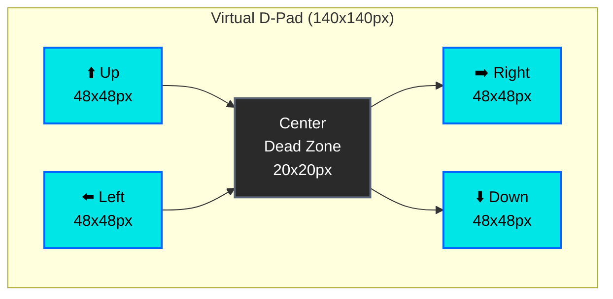

<p align="center">
  
</p>

<h1 align="center">📱 Black Trigram — Mobile Controls Implementation Guide</h1>

<p align="center">
  <strong>🎮 Touch Controls, Virtual D-Pad, and Gesture Systems</strong><br>
  <em>🎯 Mobile-Optimized Korean Martial Arts Combat Interface</em>
</p>

<p align="center">
  <a href="#"></a>
  <a href="#"></a>
  <a href="#"></a>
  <a href="#"></a>
</p>

**📋 Document Owner:** Development Team | **📄 Version:** 1.0 | **📅 Last Updated:** 2026-01-01 (UTC)  
**🔄 Review Cycle:** Quarterly | **⏰ Next Review:** 2026-04-01

---

## 🎯 **Purpose**

This guide defines the **mobile control systems** for Black Trigram, providing touch-optimized virtual controls, gesture recognition, and haptic feedback patterns that maintain the Korean martial arts experience on mobile devices.

---

## 🕹️ **Virtual D-Pad Implementation**

### **D-Pad Specifications**

```typescript
// Virtual D-pad configuration
export const VIRTUAL_DPAD = {
  // Container dimensions
  CONTAINER_SIZE: 140,      // 140x140px container
  
  // Button dimensions
  BUTTON_SIZE: 48,          // 48x48px per direction button
  BUTTON_PADDING: 4,        // 4px gap between buttons
  
  // Center dead zone
  CENTER_DEAD_ZONE: 20,     // 20px center area (no input)
  
  // Colors (Korean theming)
  IDLE_COLOR: 0x2a2a2a,           // Dark gray - idle state
  ACTIVE_COLOR: 0x00e6e6,         // Cyan - active state
  BORDER_COLOR: 0x5a6578,         // Border color
  
  // Opacity
  IDLE_OPACITY: 0.6,
  ACTIVE_OPACITY: 1.0,
} as const;
```

### **D-Pad Layout**



### **D-Pad Component Implementation**

```typescript
import { KOREAN_COLORS } from '@/types/constants';

interface VirtualDPadProps {
  readonly onDirectionChange: (direction: Direction | null) => void;
  readonly position: { x: number; y: number };
  readonly size?: number;
}

type Direction = 'up' | 'down' | 'left' | 'right';

export const VirtualDPad: React.FC<VirtualDPadProps> = ({
  onDirectionChange,
  position,
  size = 140,
}) => {
  const [activeDirection, setActiveDirection] = useState<Direction | null>(null);
  const buttonSize = size * 0.34; // ~48px for 140px container

  const handleTouch = useCallback((direction: Direction) => {
    setActiveDirection(direction);
    onDirectionChange(direction);
    
    // Haptic feedback
    if (navigator.vibrate) {
      navigator.vibrate(10); // 10ms haptic pulse
    }
  }, [onDirectionChange]);

  const handleTouchEnd = useCallback(() => {
    setActiveDirection(null);
    onDirectionChange(null);
  }, [onDirectionChange]);

  return (
    <div
      style={{
        position: 'absolute',
        left: position.x,
        top: position.y,
        width: size,
        height: size,
        display: 'grid',
        gridTemplateColumns: `${buttonSize}px ${buttonSize}px ${buttonSize}px`,
        gridTemplateRows: `${buttonSize}px ${buttonSize}px ${buttonSize}px`,
        gap: 4,
      }}
      data-testid="virtual-dpad"
    >
      {/* Empty top-left */}
      <div />
      
      {/* Up button */}
      <DPadButton
        direction="up"
        active={activeDirection === 'up'}
        onTouchStart={() => handleTouch('up')}
        onTouchEnd={handleTouchEnd}
        icon="⬆️"
      />
      
      {/* Empty top-right */}
      <div />
      
      {/* Left button */}
      <DPadButton
        direction="left"
        active={activeDirection === 'left'}
        onTouchStart={() => handleTouch('left')}
        onTouchEnd={handleTouchEnd}
        icon="⬅️"
      />
      
      {/* Center dead zone */}
      <div style={{
        width: buttonSize,
        height: buttonSize,
        background: '#1a1a1a',
        border: '2px solid #5a6578',
        borderRadius: 8,
      }} />
      
      {/* Right button */}
      <DPadButton
        direction="right"
        active={activeDirection === 'right'}
        onTouchStart={() => handleTouch('right')}
        onTouchEnd={handleTouchEnd}
        icon="➡️"
      />
      
      {/* Empty bottom-left */}
      <div />
      
      {/* Down button */}
      <DPadButton
        direction="down"
        active={activeDirection === 'down'}
        onTouchStart={() => handleTouch('down')}
        onTouchEnd={handleTouchEnd}
        icon="⬇️"
      />
      
      {/* Empty bottom-right */}
      <div />
    </div>
  );
};

// Individual D-pad button
const DPadButton: React.FC<{
  direction: Direction;
  active: boolean;
  onTouchStart: () => void;
  onTouchEnd: () => void;
  icon: string;
}> = ({ direction, active, onTouchStart, onTouchEnd, icon }) => {
  return (
    <button
      onTouchStart={onTouchStart}
      onTouchEnd={onTouchEnd}
      style={{
        width: 48,
        height: 48,
        background: active ? '#00e6e6' : '#2a2a2a',
        border: `2px solid ${active ? '#0066ff' : '#5a6578'}`,
        borderRadius: 8,
        color: active ? '#000' : '#fff',
        fontSize: 24,
        cursor: 'pointer',
        userSelect: 'none',
        opacity: active ? 1.0 : 0.6,
        transition: 'all 150ms ease-out',
      }}
      data-testid={`dpad-${direction}`}
    >
      {icon}
    </button>
  );
};
```

---

## ⚔️ **Action Buttons**

### **Button Specifications**

```typescript
// Action button configuration
export const ACTION_BUTTONS = {
  // Attack button (primary action)
  ATTACK: {
    SIZE: 80,               // 80x80px
    COLOR: 0xff4444,        // Red (danger)
    LABEL_KR: '공격',
    LABEL_EN: 'Attack',
    ICON: '⚔️',
  },
  
  // Block button (defensive action)
  BLOCK: {
    SIZE: 70,               // 70x70px
    COLOR: 0x0066ff,        // Blue (defensive)
    LABEL_KR: '방어',
    LABEL_EN: 'Block',
    ICON: '🛡️',
  },
  
  // Special technique button
  SPECIAL: {
    SIZE: 70,               // 70x70px
    COLOR: 0xffc400,        // Gold (special)
    LABEL_KR: '필살기',
    LABEL_EN: 'Special',
    ICON: '✨',
  },
} as const;
```

### **Action Button Layout**

```typescript
// Right-hand action buttons (for right-handed players)
const ActionButtons: React.FC = ({ onAttack, onBlock, onSpecial }) => {
  return (
    <div style={{
      position: 'fixed',
      right: 20,
      bottom: 100,
      display: 'flex',
      flexDirection: 'column',
      gap: 16,
      alignItems: 'flex-end',
    }}>
      {/* Attack button (largest, bottom) */}
      <ActionButton
        size={ACTION_BUTTONS.ATTACK.SIZE}
        color={ACTION_BUTTONS.ATTACK.COLOR}
        korean={ACTION_BUTTONS.ATTACK.LABEL_KR}
        english={ACTION_BUTTONS.ATTACK.LABEL_EN}
        icon={ACTION_BUTTONS.ATTACK.ICON}
        onClick={onAttack}
        hapticDuration={50} // Medium haptic for attack
      />
      
      {/* Block button (medium) */}
      <ActionButton
        size={ACTION_BUTTONS.BLOCK.SIZE}
        color={ACTION_BUTTONS.BLOCK.COLOR}
        korean={ACTION_BUTTONS.BLOCK.LABEL_KR}
        english={ACTION_BUTTONS.BLOCK.LABEL_EN}
        icon={ACTION_BUTTONS.BLOCK.ICON}
        onClick={onBlock}
        hapticDuration={30} // Light haptic for block
      />
      
      {/* Special button (medium) */}
      <ActionButton
        size={ACTION_BUTTONS.SPECIAL.SIZE}
        color={ACTION_BUTTONS.SPECIAL.COLOR}
        korean={ACTION_BUTTONS.SPECIAL.LABEL_KR}
        english={ACTION_BUTTONS.SPECIAL.LABEL_EN}
        icon={ACTION_BUTTONS.SPECIAL.ICON}
        onClick={onSpecial}
        hapticDuration={100} // Strong haptic for special
      />
    </div>
  );
};
```

---

## 🔄 **Stance Wheel (Trigram Selector)**

### **Stance Wheel Specifications**

```typescript
// Stance wheel configuration (Eight Trigrams)
export const STANCE_WHEEL = {
  DIAMETER: 200,            // 200px diameter
  BUTTON_SIZE: 48,          // 48x48px per trigram
  CENTER_SIZE: 60,          // 60x60px center indicator
  ROTATION: 360 / 8,        // 45° between each trigram
  
  // Trigram positions (clockwise from top)
  POSITIONS: [
    { name: 'geon', angle: 0,   icon: '☰', korean: '건', english: 'Heaven' },
    { name: 'tae',  angle: 45,  icon: '☱', korean: '태', english: 'Lake' },
    { name: 'li',   angle: 90,  icon: '☲', korean: '리', english: 'Fire' },
    { name: 'jin',  angle: 135, icon: '☳', korean: '진', english: 'Thunder' },
    { name: 'son',  angle: 180, icon: '☴', korean: '손', english: 'Wind' },
    { name: 'gam',  angle: 225, icon: '☵', korean: '감', english: 'Water' },
    { name: 'gan',  angle: 270, icon: '☶', korean: '간', english: 'Mountain' },
    { name: 'gon',  angle: 315, icon: '☷', korean: '곤', english: 'Earth' },
  ],
} as const;
```

### **Stance Wheel Implementation**

```typescript
const StanceWheel: React.FC<{
  onStanceSelect: (stance: string) => void;
  currentStance: string;
}> = ({ onStanceSelect, currentStance }) => {
  const [isOpen, setIsOpen] = useState(false);
  const radius = STANCE_WHEEL.DIAMETER / 2;

  const getButtonPosition = (angle: number) => {
    const radians = (angle - 90) * (Math.PI / 180);
    const distance = radius - STANCE_WHEEL.BUTTON_SIZE;
    return {
      x: radius + distance * Math.cos(radians) - STANCE_WHEEL.BUTTON_SIZE / 2,
      y: radius + distance * Math.sin(radians) - STANCE_WHEEL.BUTTON_SIZE / 2,
    };
  };

  return (
    <div
      style={{
        position: 'fixed',
        left: 20,
        top: '50%',
        transform: 'translateY(-50%)',
        width: STANCE_WHEEL.DIAMETER,
        height: STANCE_WHEEL.DIAMETER,
      }}
      data-testid="stance-wheel"
    >
      {/* Center button to toggle wheel */}
      <button
        onClick={() => setIsOpen(!isOpen)}
        style={{
          position: 'absolute',
          left: radius - STANCE_WHEEL.CENTER_SIZE / 2,
          top: radius - STANCE_WHEEL.CENTER_SIZE / 2,
          width: STANCE_WHEEL.CENTER_SIZE,
          height: STANCE_WHEEL.CENTER_SIZE,
          background: '#00e6e6',
          border: '2px solid #0066ff',
          borderRadius: '50%',
          fontSize: 24,
          zIndex: 10,
        }}
      >
        {currentStance ? getStanceIcon(currentStance) : '☯️'}
      </button>

      {/* Trigram buttons (only visible when open) */}
      {isOpen && STANCE_WHEEL.POSITIONS.map((pos) => {
        const position = getButtonPosition(pos.angle);
        const isSelected = currentStance === pos.name;

        return (
          <button
            key={pos.name}
            onClick={() => {
              onStanceSelect(pos.name);
              setIsOpen(false);
              if (navigator.vibrate) {
                navigator.vibrate(50);
              }
            }}
            style={{
              position: 'absolute',
              left: position.x,
              top: position.y,
              width: STANCE_WHEEL.BUTTON_SIZE,
              height: STANCE_WHEEL.BUTTON_SIZE,
              background: isSelected ? '#ffc400' : '#2a2a2a',
              border: `2px solid ${isSelected ? '#ff8800' : '#5a6578'}`,
              borderRadius: '50%',
              fontSize: 20,
              opacity: isSelected ? 1.0 : 0.8,
            }}
            data-testid={`stance-${pos.name}`}
            title={`${pos.korean} | ${pos.english}`}
          >
            {pos.icon}
          </button>
        );
      })}
    </div>
  );
};
```

---

## 📳 **Haptic Feedback Integration**

### **Haptic Patterns**

```typescript
// Haptic feedback durations (milliseconds)
export const HAPTIC_FEEDBACK = {
  LIGHT: 10,        // Light tap (button press)
  MEDIUM: 50,       // Medium pulse (attack)
  STRONG: 100,      // Strong pulse (special move)
  DOUBLE: [50, 30], // Double tap (critical hit)
  TRIPLE: [30, 20, 30], // Triple tap (combo)
} as const;

// Haptic feedback utility
export const triggerHaptic = (pattern: number | number[]): void => {
  if (!navigator.vibrate) return;

  if (Array.isArray(pattern)) {
    navigator.vibrate(pattern);
  } else {
    navigator.vibrate(pattern);
  }
};

// Usage examples
triggerHaptic(HAPTIC_FEEDBACK.LIGHT);   // Button press
triggerHaptic(HAPTIC_FEEDBACK.MEDIUM);  // Attack
triggerHaptic(HAPTIC_FEEDBACK.STRONG);  // Special move
triggerHaptic(HAPTIC_FEEDBACK.DOUBLE);  // Critical hit
```

### **Haptic Feedback Integration**

```typescript
// Add haptic to button interactions
const HapticButton: React.FC<ButtonProps> = ({ 
  onClick, 
  hapticDuration = 10,
  ...props 
}) => {
  const handleClick = useCallback((e: React.MouseEvent) => {
    // Trigger haptic feedback
    triggerHaptic(hapticDuration);
    
    // Call original onClick
    onClick?.(e);
  }, [onClick, hapticDuration]);

  return <button onClick={handleClick} {...props} />;
};
```

---

## 👆 **Gesture Control Patterns**

### **Swipe Gestures**

```typescript
// Swipe gesture detection
export const useSwipeGesture = (
  onSwipe: (direction: 'left' | 'right' | 'up' | 'down') => void
) => {
  const touchStartRef = useRef<{ x: number; y: number } | null>(null);
  const SWIPE_THRESHOLD = 50; // 50px minimum swipe distance

  const handleTouchStart = useCallback((e: React.TouchEvent) => {
    const touch = e.touches[0];
    touchStartRef.current = { x: touch.clientX, y: touch.clientY };
  }, []);

  const handleTouchEnd = useCallback((e: React.TouchEvent) => {
    if (!touchStartRef.current) return;

    const touch = e.changedTouches[0];
    const deltaX = touch.clientX - touchStartRef.current.x;
    const deltaY = touch.clientY - touchStartRef.current.y;

    // Determine swipe direction
    if (Math.abs(deltaX) > Math.abs(deltaY)) {
      // Horizontal swipe
      if (Math.abs(deltaX) > SWIPE_THRESHOLD) {
        onSwipe(deltaX > 0 ? 'right' : 'left');
        triggerHaptic(HAPTIC_FEEDBACK.MEDIUM);
      }
    } else {
      // Vertical swipe
      if (Math.abs(deltaY) > SWIPE_THRESHOLD) {
        onSwipe(deltaY > 0 ? 'down' : 'up');
        triggerHaptic(HAPTIC_FEEDBACK.MEDIUM);
      }
    }

    touchStartRef.current = null;
  }, [onSwipe]);

  return { handleTouchStart, handleTouchEnd };
};

// Usage
const CombatScreen: React.FC = () => {
  const { handleTouchStart, handleTouchEnd } = useSwipeGesture((direction) => {
    console.log(`Swiped ${direction}`);
    // Handle dodge/evade based on swipe direction
  });

  return (
    <div onTouchStart={handleTouchStart} onTouchEnd={handleTouchEnd}>
      {/* Game content */}
    </div>
  );
};
```

### **Tap Gestures**

```typescript
// Double-tap detection
export const useDoubleTap = (onDoubleTap: () => void) => {
  const lastTapRef = useRef<number>(0);
  const DOUBLE_TAP_DELAY = 300; // 300ms maximum between taps

  const handleTap = useCallback(() => {
    const now = Date.now();
    const timeSinceLastTap = now - lastTapRef.current;

    if (timeSinceLastTap < DOUBLE_TAP_DELAY) {
      // Double tap detected
      onDoubleTap();
      triggerHaptic(HAPTIC_FEEDBACK.DOUBLE);
      lastTapRef.current = 0;
    } else {
      // First tap
      lastTapRef.current = now;
    }
  }, [onDoubleTap]);

  return { handleTap };
};
```

---

## 🎯 **Mobile Control Best Practices**

### **✅ Do's**

1. **Use large touch targets** (minimum 48x48px)
2. **Provide haptic feedback** for all interactions
3. **Support one-handed operation** where possible
4. **Test on actual devices** (not just simulators)
5. **Respect safe areas** (iOS notch, Android nav bars)
6. **Show visual feedback** for touch events
7. **Optimize for thumb reach** (bottom 2/3 of screen)
8. **Provide alternative layouts** (left/right-handed)

### **❌ Don'ts**

1. ❌ Use touch targets smaller than 44x44px
2. ❌ Forget haptic feedback for actions
3. ❌ Place critical controls at screen edges
4. ❌ Ignore orientation changes
5. ❌ Use complex multi-touch gestures
6. ❌ Forget about different screen sizes
7. ❌ Rely on hover states (they don't exist on mobile)
8. ❌ Use desktop-only interaction patterns

---

## 📚 **Related Documents**

- [🏗️ UI/UX Architecture](./UI_UX_ARCHITECTURE.md) - Component hierarchy and design patterns
- [📐 Responsive Design](./RESPONSIVE_DESIGN.md) - Breakpoints and layout system
- [🎨 Korean Theming Guide](./KOREAN_THEMING_GUIDE.md) - Mobile color and typography
- [🌐 Three.js UI Integration](./THREEJS_UI_INTEGRATION.md) - 3D mobile considerations
- [♿ Accessibility Guide](./ACCESSIBILITY_GUIDE.md) - Mobile accessibility standards

---

**📋 Document Control:**  
**✅ Approved by:** Development Team  
**📤 Distribution:** Public  
**🏷️ Classification:** [](https://github.com/Hack23/ISMS-PUBLIC/blob/main/CLASSIFICATION.md#confidentiality-levels)  
**📅 Effective Date:** 2026-01-01  
**⏰ Next Review:** 2026-04-01  
**🎯 Framework Compliance:** [](https://github.com/Hack23/ISMS-PUBLIC/blob/main/CLASSIFICATION.md) [](https://github.com/Hack23/ISMS-PUBLIC/blob/main/Secure_Development_Policy.md)

---

**🥋 흑괘의 길을 걸어라** - _Walk the Path of the Black Trigram_
