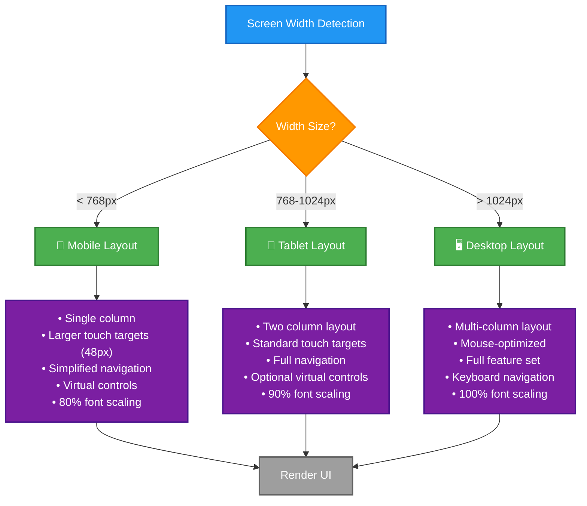

<p align="center">
  
</p>

<h1 align="center">📐 Black Trigram — Responsive Design System</h1>

<p align="center">
  <strong>📱 Mobile-First Responsive Layout Architecture</strong><br>
  <em>🎯 Breakpoints, Layout Utilities, and Safe Area Handling</em>
</p>

<p align="center">
  <a href="#"></a>
  <a href="#"></a>
  <a href="#"></a>
  <a href="#"></a>
</p>

**📋 Document Owner:** Development Team | **📄 Version:** 1.0 | **📅 Last Updated:** 2026-01-01 (UTC)  
**🔄 Review Cycle:** Quarterly | **⏰ Next Review:** 2026-04-01

---

## 🎯 **Purpose**

This document defines Black Trigram's **responsive design system**, providing standardized breakpoints, layout calculation utilities, and safe area handling to ensure optimal user experience across all device sizes while maintaining the Korean cyberpunk aesthetic.

---

## 📱 **Breakpoint System**

### **Standard Breakpoints**

```typescript
// Standardized responsive breakpoints
export const BREAKPOINTS = {
  MOBILE: 768,     // < 768px - Mobile phones
  TABLET: 1024,    // 768px - 1024px - Tablets
  DESKTOP: 1024,   // > 1024px - Desktop screens
} as const;

// Device detection
export const getDeviceType = (width: number): 'mobile' | 'tablet' | 'desktop' => {
  if (width < BREAKPOINTS.MOBILE) return 'mobile';
  if (width < BREAKPOINTS.DESKTOP) return 'tablet';
  return 'desktop';
};

// Usage in components
const isMobile = useMemo(() => width < BREAKPOINTS.MOBILE, [width]);
const isTablet = useMemo(
  () => width >= BREAKPOINTS.MOBILE && width < BREAKPOINTS.DESKTOP,
  [width]
);
const isDesktop = useMemo(() => width >= BREAKPOINTS.DESKTOP, [width]);
```

### **Responsive Design Flow**



---

## 🧮 **Layout Calculation Utilities**

### **Responsive Font Size**

```typescript
/**
 * Calculate responsive font size
 * Mobile: 80% of base
 * Tablet: 90% of base
 * Desktop: 100% of base
 */
export function calculateResponsiveFontSize(
  baseSize: number,
  deviceType: 'mobile' | 'tablet' | 'desktop'
): number {
  switch (deviceType) {
    case 'mobile':
      return Math.round(baseSize * 0.8);
    case 'tablet':
      return Math.round(baseSize * 0.9);
    case 'desktop':
    default:
      return baseSize;
  }
}

// Usage
const fontSize = calculateResponsiveFontSize(16, 'mobile'); // 13px
const fontSize = calculateResponsiveFontSize(16, 'tablet'); // 14px
const fontSize = calculateResponsiveFontSize(16, 'desktop'); // 16px
```

### **Responsive Padding**

```typescript
/**
 * Calculate responsive padding
 * Mobile: 70% of base
 * Tablet: 85% of base
 * Desktop: 100% of base
 */
export function calculateResponsivePadding(
  basePadding: number,
  deviceType: 'mobile' | 'tablet' | 'desktop'
): number {
  switch (deviceType) {
    case 'mobile':
      return Math.round(basePadding * 0.7);
    case 'tablet':
      return Math.round(basePadding * 0.85);
    case 'desktop':
    default:
      return basePadding;
  }
}

// Usage
const padding = calculateResponsivePadding(20, 'mobile'); // 14px
const padding = calculateResponsivePadding(20, 'tablet'); // 17px
const padding = calculateResponsivePadding(20, 'desktop'); // 20px
```

### **Responsive Spacing**

```typescript
/**
 * Calculate responsive spacing between elements
 */
export function calculateResponsiveSpacing(
  baseSpacing: number,
  deviceType: 'mobile' | 'tablet' | 'desktop'
): number {
  switch (deviceType) {
    case 'mobile':
      return Math.round(baseSpacing * 0.6);
    case 'tablet':
      return Math.round(baseSpacing * 0.8);
    case 'desktop':
    default:
      return baseSpacing;
  }
}

// Usage
const spacing = calculateResponsiveSpacing(15, 'mobile'); // 9px
const spacing = calculateResponsiveSpacing(15, 'tablet'); // 12px
const spacing = calculateResponsiveSpacing(15, 'desktop'); // 15px
```

### **Complete Layout Constants**

```typescript
/**
 * Get all layout constants for a device type
 */
export function getLayoutConstants(deviceType: 'mobile' | 'tablet' | 'desktop') {
  const baseValues = {
    padding: 20,
    headerHeight: 60,
    buttonSize: 48,
    fontSize: 16,
    spacing: 15,
  };

  return {
    padding: calculateResponsivePadding(baseValues.padding, deviceType),
    headerHeight: deviceType === 'mobile' ? 50 : baseValues.headerHeight,
    buttonSize: deviceType === 'mobile' ? 56 : baseValues.buttonSize,
    fontSize: calculateResponsiveFontSize(baseValues.fontSize, deviceType),
    spacing: calculateResponsiveSpacing(baseValues.spacing, deviceType),
  };
}

// Usage
const layout = getLayoutConstants('mobile');
// Returns: { padding: 14, headerHeight: 50, buttonSize: 56, fontSize: 13, spacing: 9 }
```

---

## 📏 **Safe Area Handling**

### **iOS Safe Area Insets**

```typescript
// iOS safe area constants
export const SAFE_AREA = {
  TOP: 44,      // iOS status bar + notch
  BOTTOM: 34,   // iOS home indicator
  LEFT: 0,      // Portrait mode
  RIGHT: 0,     // Portrait mode
  
  // Landscape mode
  LANDSCAPE_LEFT: 44,
  LANDSCAPE_RIGHT: 44,
} as const;

// Apply safe padding to fullscreen layouts
const safeLayoutStyle = {
  paddingTop: SAFE_AREA.TOP,
  paddingBottom: SAFE_AREA.BOTTOM,
  paddingLeft: SAFE_AREA.LEFT,
  paddingRight: SAFE_AREA.RIGHT,
};
```

### **CSS Environment Variables**

```css
/* Use CSS environment variables for safe area */
.fullscreen-layout {
  padding-top: env(safe-area-inset-top, 0px);
  padding-bottom: env(safe-area-inset-bottom, 0px);
  padding-left: env(safe-area-inset-left, 0px);
  padding-right: env(safe-area-inset-right, 0px);
}

/* Korean-themed mobile controls with safe area */
.mobile-controls {
  position: fixed;
  bottom: calc(34px + env(safe-area-inset-bottom, 0px));
  left: calc(20px + env(safe-area-inset-left, 0px));
  right: calc(20px + env(safe-area-inset-right, 0px));
}
```

### **Safe Area in React Components**

```typescript
import { useSafeArea } from '@/hooks/useSafeArea';

const MobileHUD: React.FC = () => {
  const safeArea = useSafeArea();

  return (
    <div style={{
      position: 'fixed',
      top: safeArea.top,
      bottom: safeArea.bottom,
      left: safeArea.left,
      right: safeArea.right,
      display: 'flex',
      flexDirection: 'column',
    }}>
      <KoreanHeader />
      <div style={{ flex: 1 }}>
        {/* Content */}
      </div>
      <MobileControls />
    </div>
  );
};
```

---

## 🎨 **Responsive Layout Patterns**

### **Mobile-First Approach**

```typescript
// Start with mobile layout, enhance for larger screens
const ResponsiveLayout: React.FC<{ width: number }> = ({ width }) => {
  const deviceType = getDeviceType(width);
  const layout = getLayoutConstants(deviceType);

  return (
    <div style={{
      display: 'flex',
      flexDirection: deviceType === 'mobile' ? 'column' : 'row',
      padding: layout.padding,
      gap: layout.spacing,
    }}>
      <aside style={{
        width: deviceType === 'mobile' ? '100%' : '250px',
        marginBottom: deviceType === 'mobile' ? layout.spacing : 0,
      }}>
        <Sidebar />
      </aside>
      
      <main style={{ flex: 1 }}>
        <Content />
      </main>
    </div>
  );
};
```

### **Grid Layout System**

```typescript
/**
 * Calculate grid layout based on screen size
 */
export function calculateGridLayout(
  totalItems: number,
  deviceType: 'mobile' | 'tablet' | 'desktop',
  gap: number = 16
) {
  const columns = deviceType === 'mobile' ? 1 : deviceType === 'tablet' ? 2 : 3;
  const rows = Math.ceil(totalItems / columns);

  return {
    columns,
    rows,
    gap,
    gridTemplateColumns: `repeat(${columns}, 1fr)`,
  };
}

// Usage
const GridLayout: React.FC = () => {
  const deviceType = getDeviceType(width);
  const grid = calculateGridLayout(9, deviceType, 16);

  return (
    <div style={{
      display: 'grid',
      gridTemplateColumns: grid.gridTemplateColumns,
      gap: grid.gap,
    }}>
      {items.map((item) => (
        <GridItem key={item.id} item={item} />
      ))}
    </div>
  );
};
```

### **Responsive Container Component**

```typescript
import { ResponsiveContainer } from '@/components/base';

// Responsive container with automatic layout switching
<ResponsiveContainer
  breakpoint={768}
  mobileLayout="column"
  desktopLayout="row"
  safePadding={34}
  gap={16}
>
  <Component1 />
  <Component2 />
  <Component3 />
</ResponsiveContainer>
```

---

## 🎯 **Touch Target Sizes**

### **Minimum Touch Target Standards**

```typescript
// Touch target size standards
export const TOUCH_TARGETS = {
  MINIMUM: 44,    // iOS guideline (44x44pt)
  COMFORTABLE: 48, // Android Material Design (48x48dp)
  LARGE: 56,      // Large buttons for important actions
  SMALL: 32,      // Small buttons (secondary actions)
} as const;

// Apply to interactive elements
const buttonStyle = {
  minWidth: TOUCH_TARGETS.COMFORTABLE,
  minHeight: TOUCH_TARGETS.COMFORTABLE,
  padding: '12px 24px',
};
```

### **Mobile Button Sizing**

```typescript
// Mobile-optimized button sizes
export const MOBILE_BUTTON_SIZES = {
  SMALL: { width: 80, height: 48 },   // Secondary actions
  MEDIUM: { width: 120, height: 56 }, // Primary actions
  LARGE: { width: 200, height: 64 },  // Call-to-action
  ICON: { width: 48, height: 48 },    // Icon-only buttons
} as const;
```

---

## 📊 **Responsive Design Metrics**

### **Performance Targets**

| **Metric** | **Mobile** | **Tablet** | **Desktop** |
|------------|-----------|-----------|-------------|
| **First Contentful Paint** | < 1.5s | < 1.2s | < 1.0s |
| **Time to Interactive** | < 3.0s | < 2.5s | < 2.0s |
| **Lighthouse Score** | > 85 | > 90 | > 95 |
| **Touch Target Size** | ≥ 48px | ≥ 44px | N/A |
| **Font Size (Minimum)** | ≥ 13px | ≥ 14px | ≥ 16px |

### **Testing Checklist**

- [ ] **Mobile Portrait** (375x667 - iPhone SE)
- [ ] **Mobile Landscape** (667x375)
- [ ] **Tablet Portrait** (768x1024 - iPad)
- [ ] **Tablet Landscape** (1024x768)
- [ ] **Desktop** (1920x1080)
- [ ] **Touch targets** ≥ 48x48px on mobile
- [ ] **Text readability** at all screen sizes
- [ ] **Safe area** handling on iOS devices
- [ ] **Orientation changes** handled gracefully
- [ ] **Performance metrics** meet targets

---

## 📚 **Related Documents**

- [🏗️ UI/UX Architecture](./UI_UX_ARCHITECTURE.md) - Component hierarchy and design patterns
- [🎨 Korean Theming Guide](./KOREAN_THEMING_GUIDE.md) - Color palette and typography standards
- [📱 Mobile Controls](./MOBILE_CONTROLS.md) - Mobile-specific control implementation
- [🌐 Three.js UI Integration](./THREEJS_UI_INTEGRATION.md) - 3D responsive patterns
- [♿ Accessibility Guide](./ACCESSIBILITY_GUIDE.md) - Accessible responsive design
- [📋 Base Components README](../src/components/base/README.md) - Layout utilities documentation

---

**📋 Document Control:**  
**✅ Approved by:** Development Team  
**📤 Distribution:** Public  
**🏷️ Classification:** [](https://github.com/Hack23/ISMS-PUBLIC/blob/main/CLASSIFICATION.md#confidentiality-levels)  
**📅 Effective Date:** 2026-01-01  
**⏰ Next Review:** 2026-04-01  
**🎯 Framework Compliance:** [](https://github.com/Hack23/ISMS-PUBLIC/blob/main/CLASSIFICATION.md) [](https://github.com/Hack23/ISMS-PUBLIC/blob/main/Secure_Development_Policy.md)

---

**🥋 흑괘의 길을 걸어라** - _Walk the Path of the Black Trigram_
