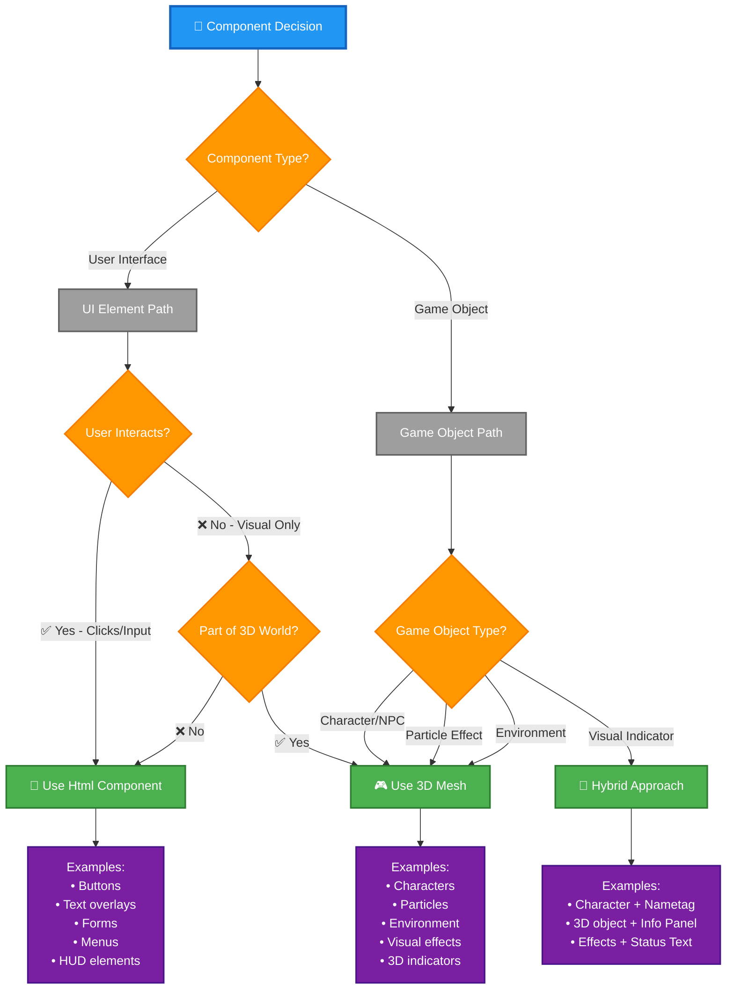

<p align="center">
  
</p>

<h1 align="center">🌐 Black Trigram — Three.js UI Integration Guide</h1>

<p align="center">
  <strong>🎮 Html Overlay Patterns and 3D Integration Best Practices</strong><br>
  <em>🎯 Performance-Optimized Three.js UI Development</em>
</p>

<p align="center">
  <a href="#"></a>
  <a href="#"></a>
  <a href="#"></a>
  <a href="#"></a>
</p>

**📋 Document Owner:** Development Team | **📄 Version:** 1.0 | **📅 Last Updated:** 2026-01-01 (UTC)  
**🔄 Review Cycle:** Quarterly | **⏰ Next Review:** 2026-04-01

---

## 🎯 **Purpose**

This guide provides comprehensive patterns for integrating UI elements with Three.js using `@react-three/fiber` and `@react-three/drei`, focusing on the **Html overlay approach** for optimal performance and accessibility while maintaining the Korean cyberpunk aesthetic.

---

## 🌟 **Html Overlay vs 3D Mesh Decision Framework**

### **Decision Flowchart**



### **Decision Matrix**

| **Criteria** | **Use Html Overlay** | **Use 3D Mesh** | **Hybrid Approach** |
|--------------|---------------------|-----------------|---------------------|
| **Interactive UI** (buttons, forms, text) | ✅ **Yes** - Best choice | ❌ No - Poor UX | ⚠️ Possible - Overlay UI on 3D |
| **Text Rendering** | ✅ **Yes** - Crisp, readable | ❌ No - Blurry, expensive | ⚠️ Possible - Html text on 3D object |
| **Game Objects** (characters, effects) | ❌ No - Not appropriate | ✅ **Yes** - Correct approach | ⚠️ Possible - 3D object + Html label |
| **Requires DOM Events** (click, hover, input) | ✅ **Yes** - Native support | ❌ No - Requires raycasting | ⚠️ Possible - Html for interaction |
| **Accessibility** (screen readers, keyboard) | ✅ **Yes** - Native HTML | ❌ No - Custom implementation | ⚠️ Possible - Html overlay for a11y |
| **Performance** (complex UI) | ✅ **Yes** - DOM optimized | ❌ No - WebGL overhead | ⚠️ Trade-off - Balance both |
| **3D Positioning** | ⚠️ Possible - With position prop | ✅ **Yes** - Native 3D | ✅ **Yes** - Both methods |
| **Visual Effects** | ❌ No - CSS only | ✅ **Yes** - Shaders, particles | ✅ **Yes** - Combined effects |

### **When to Use Each Approach**

#### **✅ Use Html Overlays For:**

```typescript
// 1. Interactive UI components
<Html position={[0, 2, 0]} center>
  <BaseButtonHTML
    korean="공격"
    english="Attack"
    onClick={handleAttack}
  />
</Html>

// 2. Text content (always prefer Html for readability)
<Html position={[0, 1, 0]} center>
  <div style={{ color: '#ffffff', fontSize: 18 }}>
    전투 시작 | Combat Start
  </div>
</Html>

// 3. Complex layouts (forms, menus, panels)
<Html fullscreen>
  <div style={{ padding: 20 }}>
    <KoreanHeader title="설정 | Settings" />
    <form onSubmit={handleSubmit}>
      {/* Form fields */}
    </form>
  </div>
</Html>

// 4. HUD elements (health bars, status indicators)
<Html fullscreen>
  <div style={{ position: 'absolute', top: 20, left: 20 }}>
    <ProgressBar type="health" current={health} max={100} />
  </div>
</Html>
```

#### **✅ Use 3D Meshes For:**

```typescript
// 1. Game characters and NPCs
<group position={[0, 0, 0]}>
  <mesh castShadow receiveShadow>
    <capsuleGeometry args={[0.5, 1.5, 16, 32]} />
    <meshStandardMaterial
      color={KOREAN_COLORS.ACCENT_GOLD}
      metalness={0.3}
      roughness={0.7}
    />
  </mesh>
</group>

// 2. Particle effects
<points>
  <bufferGeometry>
    <bufferAttribute
      attach="attributes-position"
      count={particleCount}
      array={positions}
      itemSize={3}
    />
  </bufferGeometry>
  <pointsMaterial
    size={0.1}
    color={KOREAN_COLORS.PRIMARY_CYAN}
    transparent
    opacity={0.8}
  />
</points>

// 3. Environment objects
<mesh position={[0, -1, 0]} receiveShadow>
  <planeGeometry args={[50, 50]} />
  <meshStandardMaterial
    color={KOREAN_COLORS.UI_BACKGROUND_DARK}
  />
</mesh>

// 4. Visual indicators (stance auras)
<StanceAura stance="geon" position={[0, 0, 0]} />
```

#### **✅ Use Hybrid Approach For:**

```typescript
// Character with nametag
<group position={[0, 0, 0]}>
  {/* 3D Character mesh */}
  <CharacterMesh archetype="musa" />
  
  {/* Html overlay for nametag */}
  <Html position={[0, 2.5, 0]} center>
    <div style={{
      background: 'rgba(10, 10, 10, 0.8)',
      border: '2px solid #00e6e6',
      borderRadius: 8,
      padding: 12,
      color: '#ffffff',
    }}>
      무사 | Warrior
    </div>
  </Html>
</group>
```

---

## 🎮 **Canvas Setup with Korean Theming**

### **Standard Canvas Configuration**

```typescript
import { Canvas } from '@react-three/fiber';
import { PerspectiveCamera, Environment, Html, Stats } from '@react-three/drei';
import { KOREAN_COLORS } from '@/types/constants';
import * as THREE from 'three';

interface GameCanvasProps {
  readonly width: number;
  readonly height: number;
  readonly children: React.ReactNode;
  readonly showStats?: boolean;
}

export const GameCanvas: React.FC<GameCanvasProps> = ({
  width,
  height,
  children,
  showStats = false,
}) => {
  return (
    <Canvas
      style={{ width, height }}
      gl={{
        antialias: true,
        alpha: false,
        powerPreference: 'high-performance',
      }}
      dpr={[1, 2]} // Device pixel ratio: 1x for low-end, 2x for high-end
      shadows
      onCreated={({ gl, scene }) => {
        // Korean cyberpunk background
        gl.setClearColor(KOREAN_COLORS.UI_BACKGROUND_DARK, 1);
        
        // Atmospheric fog
        scene.fog = new THREE.Fog(
          KOREAN_COLORS.UI_BACKGROUND_DARK,
          10,  // Near fog distance
          50   // Far fog distance
        );
      }}
      data-testid="game-canvas"
    >
      {/* Korean-themed lighting setup */}
      <ambientLight intensity={0.4} color={KOREAN_COLORS.PRIMARY_CYAN} />
      <directionalLight
        position={[10, 10, 5]}
        intensity={1}
        castShadow
        shadow-mapSize={[2048, 2048]}
        color={KOREAN_COLORS.ACCENT_GOLD}
      />
      <pointLight
        position={[-10, 5, -5]}
        intensity={0.5}
        color={KOREAN_COLORS.ACCENT_BLUE}
      />

      {/* Environment for realistic reflections */}
      <Environment preset="city" />

      {/* Camera setup */}
      <PerspectiveCamera 
        makeDefault 
        position={[0, 5, 10]} 
        fov={75} 
      />

      {/* Game content */}
      {children}

      {/* Performance stats in development */}
      {showStats && process.env.NODE_ENV === 'development' && (
        <Html fullscreen>
          <div style={{ position: 'absolute', top: 10, left: 10 }}>
            <Stats />
          </div>
        </Html>
      )}
    </Canvas>
  );
};
```

### **Lighting Configuration for Korean Aesthetic**

```typescript
// Korean cyberpunk lighting setup
const KoreanLighting: React.FC = () => {
  return (
    <>
      {/* Ambient light with cyan tint */}
      <ambientLight 
        intensity={0.4} 
        color={KOREAN_COLORS.PRIMARY_CYAN} 
      />
      
      {/* Main directional light (key light) with gold tone */}
      <directionalLight
        position={[10, 10, 5]}
        intensity={1}
        castShadow
        shadow-mapSize={[2048, 2048]}
        shadow-camera-far={50}
        shadow-camera-left={-10}
        shadow-camera-right={10}
        shadow-camera-top={10}
        shadow-camera-bottom={-10}
        color={KOREAN_COLORS.ACCENT_GOLD}
      />
      
      {/* Fill light (left side) with blue tone */}
      <pointLight
        position={[-10, 5, -5]}
        intensity={0.5}
        distance={20}
        decay={2}
        color={KOREAN_COLORS.ACCENT_BLUE}
      />
      
      {/* Rim light (back) with accent color */}
      <pointLight
        position={[0, 5, -10]}
        intensity={0.3}
        distance={15}
        decay={2}
        color={KOREAN_COLORS.ACCENT_PURPLE}
      />
    </>
  );
};
```

---

## ⚡ **useFrame Animation Patterns**

### **Basic Animation Loop**

```typescript
import { useFrame } from '@react-three/fiber';
import { useRef } from 'react';
import * as THREE from 'three';

// Animated component with breathing effect
export const AnimatedCharacter: React.FC<CharacterProps> = ({
  stance,
  isMoving,
}) => {
  const groupRef = useRef<THREE.Group>(null);
  const velocityRef = useRef(new THREE.Vector3());
  const timeRef = useRef(0);

  // 60fps game loop
  useFrame((state, delta) => {
    if (!groupRef.current) return;

    // Accumulate time
    timeRef.current += delta;

    // Update velocity based on stance and movement
    const targetVelocity = calculateStanceVelocity(stance, isMoving);
    velocityRef.current.lerp(targetVelocity, 0.1);

    // Apply velocity to position
    groupRef.current.position.add(
      velocityRef.current.clone().multiplyScalar(delta)
    );

    // Breathing animation (subtle scale)
    const breathScale = Math.sin(timeRef.current * 2) * 0.02 + 1;
    groupRef.current.scale.y = breathScale;

    // Combat stance rotation
    const targetRotation = getStanceRotation(stance);
    groupRef.current.rotation.y = THREE.MathUtils.lerp(
      groupRef.current.rotation.y,
      targetRotation,
      0.1 // Smoothing factor
    );
  });

  return (
    <group ref={groupRef}>
      <CharacterMesh stance={stance} />
      <StanceAuraEffect stance={stance} />
    </group>
  );
};
```

### **Optimized Animation with Conditional Updates**

```typescript
// Only update when necessary to improve performance
export const OptimizedAnimatedObject: React.FC = ({ 
  isActive, 
  targetPosition 
}) => {
  const meshRef = useRef<THREE.Mesh>(null);
  const prevActiveRef = useRef(isActive);

  useFrame((state, delta) => {
    if (!meshRef.current) return;

    // Only animate when active
    if (!isActive) return;

    // Smooth position interpolation
    meshRef.current.position.lerp(targetPosition, 0.1);

    // Rotation animation only when state changes
    if (isActive !== prevActiveRef.current) {
      meshRef.current.rotation.y += Math.PI * 2 * delta;
    }

    prevActiveRef.current = isActive;
  });

  return (
    <mesh ref={meshRef}>
      <boxGeometry args={[1, 1, 1]} />
      <meshStandardMaterial color={KOREAN_COLORS.PRIMARY_CYAN} />
    </mesh>
  );
};
```

### **⚠️ Performance Anti-Pattern: Creating Objects in useFrame**

```typescript
// ❌ BAD: Creating new objects every frame (60fps = 60 objects/second!)
useFrame(() => {
  const material = new THREE.MeshStandardMaterial({ color: 0xff0000 });
  mesh.material = material; // Memory leak!
});

// ✅ GOOD: Reuse objects with useMemo
const material = useMemo(
  () => new THREE.MeshStandardMaterial({ 
    color: KOREAN_COLORS.PRIMARY_CYAN 
  }),
  []
);

useFrame(() => {
  // Just update properties
  material.emissiveIntensity = Math.sin(state.clock.elapsedTime) * 0.5 + 0.5;
});
```

---

## 🎯 **Performance Optimization Techniques**

### **1. Geometry and Material Memoization**

```typescript
// ✅ GOOD: Memoize expensive Three.js objects
const ParticleSystem: React.FC = () => {
  // Geometry only created once
  const geometry = useMemo(
    () => new THREE.SphereGeometry(0.1, 8, 8),
    []
  );

  // Material only created once
  const material = useMemo(
    () => new THREE.MeshBasicMaterial({
      color: KOREAN_COLORS.PRIMARY_CYAN,
      transparent: true,
      opacity: 0.8,
    }),
    []
  );

  // Clean up on unmount
  useEffect(() => {
    return () => {
      geometry.dispose();
      material.dispose();
    };
  }, [geometry, material]);

  return (
    <group>
      {particles.map((pos, i) => (
        <mesh key={i} position={pos} geometry={geometry} material={material} />
      ))}
    </group>
  );
};
```

### **2. Instancing for Repeated Objects**

```typescript
import { Instances, Instance } from '@react-three/drei';

// ✅ GOOD: Use instancing for many similar objects (1000x faster!)
const OptimizedParticles: React.FC = () => {
  const particles = useMemo(
    () => Array.from({ length: 1000 }, (_, i) => ({
      id: i,
      position: [
        Math.random() * 20 - 10,
        Math.random() * 10,
        Math.random() * 20 - 10,
      ] as [number, number, number],
    })),
    []
  );

  return (
    <Instances limit={1000} range={1000}>
      <sphereGeometry args={[0.1, 8, 8]} />
      <meshBasicMaterial color={KOREAN_COLORS.PRIMARY_CYAN} />
      {particles.map((p) => (
        <Instance key={p.id} position={p.position} />
      ))}
    </Instances>
  );
};
```

### **3. Level of Detail (LOD)**

```typescript
import { Detailed } from '@react-three/drei';

// ✅ GOOD: Use LOD for distant objects
const OptimizedCharacter: React.FC = () => {
  return (
    <Detailed distances={[0, 10, 20]}>
      {/* High detail: 0-10 units from camera */}
      <HighDetailCharacter />
      
      {/* Medium detail: 10-20 units from camera */}
      <MediumDetailCharacter />
      
      {/* Low detail: 20+ units from camera */}
      <LowDetailCharacter />
    </Detailed>
  );
};

// High detail version (close-up)
const HighDetailCharacter: React.FC = () => (
  <mesh>
    <capsuleGeometry args={[0.5, 1.5, 32, 64]} /> {/* High poly count */}
    <meshStandardMaterial 
      color={KOREAN_COLORS.ACCENT_GOLD}
      metalness={0.5}
      roughness={0.5}
    />
  </mesh>
);

// Low detail version (distant)
const LowDetailCharacter: React.FC = () => (
  <mesh>
    <capsuleGeometry args={[0.5, 1.5, 8, 16]} /> {/* Low poly count */}
    <meshBasicMaterial color={KOREAN_COLORS.ACCENT_GOLD} />
  </mesh>
);
```

### **4. Texture Optimization**

```typescript
import { useTexture } from '@react-three/drei';

// ✅ GOOD: Optimize textures
const OptimizedTexturedMesh: React.FC = () => {
  // Load texture once
  const texture = useTexture('/textures/character.png', (tex) => {
    // Optimize on load
    tex.minFilter = THREE.LinearMipmapLinearFilter;
    tex.magFilter = THREE.LinearFilter;
    tex.anisotropy = 4; // Balance quality vs performance
    tex.generateMipmaps = true;
  });

  return (
    <mesh>
      <planeGeometry args={[2, 2]} />
      <meshBasicMaterial map={texture} transparent />
    </mesh>
  );
};
```

---

## 🧹 **Resource Cleanup Patterns**

### **Always Dispose Three.js Objects**

```typescript
// ✅ GOOD: Proper cleanup
const CleanComponent: React.FC = () => {
  const geometry = useMemo(() => new THREE.BoxGeometry(), []);
  const material = useMemo(
    () => new THREE.MeshStandardMaterial({ 
      color: KOREAN_COLORS.PRIMARY_CYAN 
    }),
    []
  );
  const textureRef = useRef<THREE.Texture | null>(null);

  // Load texture
  useEffect(() => {
    const loader = new THREE.TextureLoader();
    loader.load('/texture.png', (tex) => {
      textureRef.current = tex;
      material.map = tex;
      material.needsUpdate = true;
    });
  }, [material]);

  // Clean up on unmount
  useEffect(() => {
    return () => {
      geometry.dispose();
      material.dispose();
      if (textureRef.current) {
        textureRef.current.dispose();
      }
    };
  }, [geometry, material]);

  return (
    <mesh geometry={geometry} material={material} />
  );
};
```

---

## 📝 **TypeScript Types for Three.js**

### **Standard Type Definitions**

```typescript
import * as THREE from 'three';
import { ThreeEvent, RootState } from '@react-three/fiber';

// Mesh and Group refs
interface MeshRef {
  current: THREE.Mesh | null;
}

interface GroupRef {
  current: THREE.Group | null;
}

// Event handler types
type PointerEventHandler = (event: ThreeEvent<PointerEvent>) => void;
type ClickEventHandler = (event: ThreeEvent<MouseEvent>) => void;

// Component props with Three.js types
interface Mesh3DProps {
  readonly position?: THREE.Vector3Tuple; // [x, y, z]
  readonly rotation?: THREE.EulerTuple;   // [x, y, z, order?]
  readonly scale?: number | THREE.Vector3Tuple;
  readonly color?: THREE.ColorRepresentation;
  readonly onClick?: ClickEventHandler;
  readonly onPointerOver?: PointerEventHandler;
  readonly onPointerOut?: PointerEventHandler;
}

// Material configuration
interface KoreanMaterialConfig {
  readonly color: number;
  readonly metalness?: number;
  readonly roughness?: number;
  readonly emissive?: number;
  readonly emissiveIntensity?: number;
  readonly transparent?: boolean;
  readonly opacity?: number;
}

// Scene state from useFrame
interface Scene3DState {
  readonly camera: THREE.PerspectiveCamera;
  readonly scene: THREE.Scene;
  readonly gl: THREE.WebGLRenderer;
  readonly clock: THREE.Clock;
}
```

---

## 🧪 **Testing Three.js Components**

### **Test Setup**

```typescript
import { render } from '@testing-library/react';
import { Canvas } from '@react-three/fiber';
import { describe, it, expect } from 'vitest';
import { Suspense } from 'react';

// Helper to render Three.js components
function render3D(component: React.ReactElement) {
  return render(
    <Canvas>
      <Suspense fallback={null}>
        {component}
      </Suspense>
    </Canvas>
  );
}

describe('KoreanButton3D', () => {
  it('should render without crashing', () => {
    const { container } = render3D(
      <KoreanButton3D 
        korean="공격"
        english="Attack"
        onClick={() => {}}
      />
    );

    expect(container.querySelector('canvas')).toBeInTheDocument();
  });

  it('should apply Korean theming', () => {
    const { container } = render3D(
      <KoreanButton3D 
        korean="공격"
        english="Attack"
        onClick={() => {}}
      />
    );

    // Test that component renders
    expect(container).toBeTruthy();
  });
});
```

---

## 📚 **Related Documents**

- [🏗️ UI/UX Architecture](./UI_UX_ARCHITECTURE.md) - Component hierarchy and design patterns
- [🎨 Korean Theming Guide](./KOREAN_THEMING_GUIDE.md) - Color palette and typography standards
- [📱 Mobile Controls](./MOBILE_CONTROLS.md) - Mobile-specific Three.js considerations
- [📐 Responsive Design](./RESPONSIVE_DESIGN.md) - Responsive Three.js patterns
- [♿ Accessibility Guide](./ACCESSIBILITY_GUIDE.md) - Making Three.js accessible
- [📋 Three.js Components README](../src/components/three/README.md) - Component-specific documentation

---

**📋 Document Control:**  
**✅ Approved by:** Development Team  
**📤 Distribution:** Public  
**🏷️ Classification:** [](https://github.com/Hack23/ISMS-PUBLIC/blob/main/CLASSIFICATION.md#confidentiality-levels)  
**📅 Effective Date:** 2026-01-01  
**⏰ Next Review:** 2026-04-01  
**🎯 Framework Compliance:** [](https://github.com/Hack23/ISMS-PUBLIC/blob/main/CLASSIFICATION.md) [](https://github.com/Hack23/ISMS-PUBLIC/blob/main/Secure_Development_Policy.md)

---

**🥋 흑괘의 길을 걸어라** - _Walk the Path of the Black Trigram_
