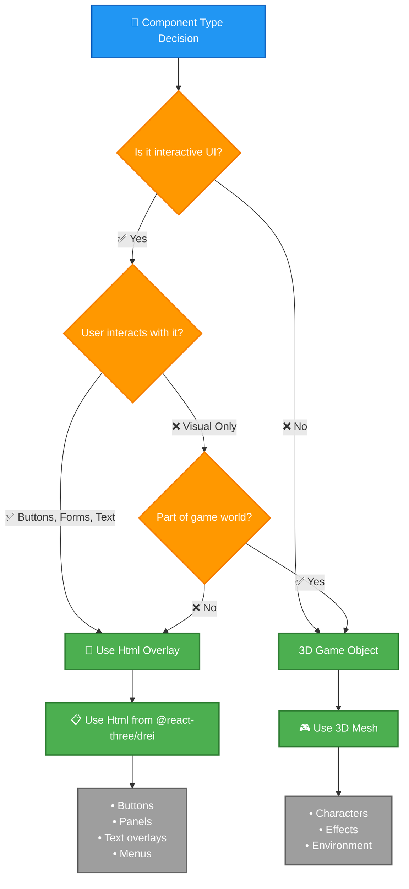

<p align="center">
  
</p>

<h1 align="center">🎨 Black Trigram — UI/UX Architecture</h1>

<p align="center">
  <strong>🥋 Korean Cyberpunk Martial Arts Interface Design</strong><br>
  <em>🎯 Component Hierarchy, Design Patterns, and Three.js Integration</em>
</p>

<p align="center">
  <a href="#"></a>
  <a href="#"></a>
  <a href="#"></a>
  <a href="#"></a>
</p>

**📋 Document Owner:** Development Team | **📄 Version:** 1.0 | **📅 Last Updated:** 2026-01-01 (UTC)  
**🔄 Review Cycle:** Quarterly | **⏰ Next Review:** 2026-04-01

---

## 🎯 **Purpose**

This document defines the **UI/UX architecture** for Black Trigram, establishing component hierarchies, design patterns, and integration approaches that maintain the Korean cyberpunk aesthetic while ensuring accessibility, performance, and maintainability.

Black Trigram's interface demonstrates **security-by-design** principles through:
- **🏆 Competitive Advantage**: Unique Korean theming differentiating from generic gaming interfaces
- **🤝 Customer Trust**: Consistent, accessible UI demonstrating attention to quality
- **⚙️ Operational Efficiency**: Reusable component system reducing development time
- **💡 Innovation Enablement**: Extensible architecture supporting future feature additions

---

## 🏗️ **Component Hierarchy**

### **📊 Architecture Overview**

```mermaid
graph TD
    ROOT[🎯 Application Root] --> BASE[📦 Base Components]
    ROOT --> SCREENS[🖥️ Screen Components]
    ROOT --> UI[🎨 UI Components]
    ROOT --> THREE[🌐 Three.js Components]
    ROOT --> MOBILE[📱 Mobile Components]
    
    BASE --> BASE_BUTTON[BaseButton/BaseButtonHTML]
    BASE --> BASE_PANEL[BasePanel]
    BASE --> BASE_TEXT[BaseText]
    BASE --> BASE_THEME[useKoreanTheme Hook]
    BASE --> BASE_LAYOUT[layoutUtils]
    
    SCREENS --> INTRO[IntroScreen]
    SCREENS --> COMBAT[CombatScreen]
    SCREENS --> TRAINING[TrainingScreen]
    SCREENS --> ENDSCREEN[EndScreen]
    
    UI --> KOREAN_HEADER[KoreanHeader]
    UI --> MOBILE_HUD[MobileHUDLayout]
    UI --> VOLUME[VolumeControl]
    UI --> ERROR[ErrorBoundary/ErrorModal]
    UI --> LOADING[LoadingState]
    UI --> SPLASH[SplashScreen]
    
    THREE --> K_BUTTON[KoreanButton]
    THREE --> K_PANEL[KoreanPanel]
    THREE --> K_TEXT[KoreanText]
    THREE --> MENU_LIST[MenuList]
    THREE --> PROGRESS[ProgressBar]
    THREE --> ARCHETYPE[ArchetypeCard]
    THREE --> STANCE_AURA[StanceAura]
    THREE --> BACKGROUND[BackgroundScene3D]
    THREE --> PLAYER3D[Player3DWithTransitions]
    THREE --> HAND3D[Hand3D]
    THREE --> MUSCLE[MuscleSystem]
    
    MOBILE --> CONTROLS[Touch Controls]
    MOBILE --> GESTURES[Gesture Handlers]
    MOBILE --> HAPTIC[Haptic Feedback]
    
    classDef base fill:#2E7D32,stroke:#1B5E20,stroke-width:2px,color:#fff
    classDef screen fill:#1565C0,stroke:#0D47A1,stroke-width:2px,color:#fff
    classDef ui fill:#7B1FA2,stroke:#4A148C,stroke-width:2px,color:#fff
    classDef three fill:#FF9800,stroke:#F57C00,stroke-width:2px,color:#fff
    classDef mobile fill:#D32F2F,stroke:#B71C1C,stroke-width:2px,color:#fff
    
    class BASE,BASE_BUTTON,BASE_PANEL,BASE_TEXT,BASE_THEME,BASE_LAYOUT base
    class SCREENS,INTRO,COMBAT,TRAINING,ENDSCREEN screen
    class UI,KOREAN_HEADER,MOBILE_HUD,VOLUME,ERROR,LOADING,SPLASH ui
    class THREE,K_BUTTON,K_PANEL,K_TEXT,MENU_LIST,PROGRESS,ARCHETYPE,STANCE_AURA,BACKGROUND,PLAYER3D,HAND3D,MUSCLE three
    class MOBILE,CONTROLS,GESTURES,HAPTIC mobile
```



### **📁 Directory Structure**

```
src/components/
├── base/                     # 🏗️ Foundational components (abstraction layer)
│   ├── BaseButton.tsx       # Enhanced Korean button (Three.js Canvas)
│   ├── BaseButtonHTML.tsx   # Enhanced Korean button (HTML DOM)
│   ├── BasePanel.tsx        # Korean-themed panel container
│   ├── BaseText.tsx         # Bilingual text component
│   ├── ResponsiveContainer.tsx  # Responsive layout container
│   ├── useKoreanTheme.ts    # Korean theming hook (centralized)
│   ├── layoutUtils.ts       # Layout calculation utilities
│   └── README.md            # Base components documentation
│
├── ui/                      # 🎨 UI Components (HTML/CSS)
│   ├── KoreanHeaderHTML.tsx # Header with Korean theming
│   ├── MobileHUDLayout.tsx  # Mobile heads-up display
│   ├── VolumeControl.tsx    # Audio control component
│   ├── ErrorBoundary.tsx    # Error handling boundary
│   ├── ErrorModal.tsx       # Error display modal
│   ├── LoadingState.tsx     # Loading indicators
│   ├── SplashScreen.tsx     # Splash screen component
│   └── ResponsiveContainer.tsx  # Responsive wrapper
│
├── three/                   # 🌐 Three.js 3D Components
│   ├── KoreanButton.tsx     # 3D button (wrapper for BaseButton)
│   ├── KoreanPanel.tsx      # 3D panel (wrapper for BasePanel)
│   ├── KoreanText.tsx       # 3D text (wrapper for BaseText)
│   ├── MenuList.tsx         # 3D menu navigation
│   ├── ProgressBar.tsx      # Health/Ki/Stamina bars
│   ├── ArchetypeCard.tsx    # Player archetype cards
│   ├── StanceAura.tsx       # Trigram stance visual effects
│   ├── StanceAuraParticles.tsx  # Particle effects for stances
│   ├── BackgroundScene3D.tsx    # 3D background scene
│   ├── Player3DWithTransitions.tsx  # Animated player model
│   ├── Hand3D.tsx           # Hand animation system
│   ├── MuscleSystem.tsx     # Muscle rendering system
│   └── README.md            # Three.js components documentation
│
├── screens/                 # 🖥️ Screen Components (full application screens)
│   ├── IntroScreen.tsx      # Game introduction screen
│   ├── CombatScreen.tsx     # Main combat gameplay
│   ├── TrainingScreen.tsx   # Training mode screen
│   └── EndScreen.tsx        # Game ending screen
│
├── mobile/                  # 📱 Mobile-Specific Components
│   ├── TouchControls.tsx    # Virtual D-pad and buttons
│   ├── StanceWheel.tsx      # Circular stance selector
│   └── GestureHandler.tsx   # Swipe and gesture detection
│
├── combat/                  # ⚔️ Combat-Specific Components
│   ├── VitalPointTargeter.tsx   # Anatomical targeting UI
│   ├── TechniqueDisplay.tsx     # Technique execution feedback
│   └── CombatLog.tsx           # Combat history display
│
└── game/                    # 🎮 Game Components
    ├── GameCanvas.tsx       # Main game rendering canvas
    └── GameHUD.tsx          # Heads-up display overlay
```

---

## 🎨 **Design Patterns**

### **1️⃣ Base Class Inheritance Pattern**

All UI components inherit Korean theming through the `useKoreanTheme` hook:

```typescript
// ✅ GOOD: Using centralized theming
import { useKoreanTheme } from '@/components/base';

const MyComponent: React.FC = () => {
  const { buttonVariant, buttonSize } = useKoreanTheme({
    variant: "primary",
    size: "md",
    isMobile: false,
  });

  return (
    <button style={{
      background: hexToRgbaString(buttonVariant.background),
      border: `2px solid ${hexToRgbaString(buttonVariant.border)}`,
      padding: buttonSize.padding,
    }}>
      Click Me
    </button>
  );
};
```

**Benefits:**
- **75% reduction** in code duplication
- **Single source of truth** for styling logic
- **Type-safe** theme application
- **Consistent** Korean aesthetic across all components

### **2️⃣ Html Overlay vs 3D Mesh Decision Framework**



**Decision Rules:**

| **Criteria** | **Use Html Overlay** | **Use 3D Mesh** |
|--------------|---------------------|-----------------|
| **Interactive UI** (buttons, forms) | ✅ Yes | ❌ No |
| **Text rendering** | ✅ Yes (better readability) | ❌ No (performance cost) |
| **Game objects** (characters, effects) | ❌ No | ✅ Yes |
| **Requires DOM events** (click, hover) | ✅ Yes | ❌ No (use raycasting) |
| **Accessibility** (screen readers) | ✅ Yes (native HTML) | ❌ No (requires workarounds) |
| **Performance** (complex UI) | ✅ Yes (DOM optimized) | ❌ No (WebGL overhead) |

### **3️⃣ Responsive Container Pattern**

```typescript
// Responsive layout with safe area handling
import { ResponsiveContainer } from '@/components/base';

<ResponsiveContainer
  breakpoint={768}
  mobileLayout="column"
  desktopLayout="row"
  safePadding={34} // iOS notch + Android nav bars
>
  <MobileControls />
  <CombatHUD />
</ResponsiveContainer>
```

**Key Features:**
- **Breakpoint-based** layout switching (mobile <768px, tablet 768-1024px, desktop >1024px)
- **Safe area** handling for iOS notches and Android navigation bars
- **Flexible layouts** (column, row, grid)
- **Built-in optimization** with `useMemo` and `useCallback`

### **4️⃣ Korean Bilingual Text Pattern**

```typescript
// ALWAYS use bilingual pattern
<BaseText
  korean="전투 시작"
  english="Combat Start"
  size="large"
  layout="vertical"  // or "horizontal"
/>
```

**Format:** `"한글 | English"` for horizontal layout, vertical stacking for vertical layout.

### **5️⃣ Component Composition Pattern**

Build complex interfaces through composition:

```typescript
// Compose simple components into complex screens
const CombatScreen: React.FC = () => {
  return (
    <GameCanvas width={1200} height={800}>
      {/* 3D Scene */}
      <BackgroundScene3D />
      <Player3DWithTransitions stance="geon" />
      <StanceAura stance="geon" />
      
      {/* Html UI Overlays */}
      <Html fullscreen>
        <KoreanHeader title="흑괘 | Black Trigram" />
        <MobileHUDLayout>
          <VolumeControl />
          <ProgressBar type="health" current={75} max={100} />
        </MobileHUDLayout>
      </Html>
    </GameCanvas>
  );
};
```

---

## 🌐 **Three.js Integration Architecture**

### **Canvas Setup Pattern**

```typescript
import { Canvas } from '@react-three/fiber';
import { PerspectiveCamera, Environment, Html } from '@react-three/drei';
import { KOREAN_COLORS } from '@/types/constants';
import * as THREE from 'three';

const GameCanvas: React.FC<{ width: number; height: number }> = ({ width, height }) => {
  return (
    <Canvas
      style={{ width, height }}
      gl={{
        antialias: true,
        alpha: false,
        powerPreference: 'high-performance',
      }}
      dpr={[1, 2]}
      shadows
      onCreated={({ gl, scene }) => {
        // Korean cyberpunk background
        gl.setClearColor(KOREAN_COLORS.UI_BACKGROUND_DARK, 1);
        scene.fog = new THREE.Fog(
          KOREAN_COLORS.UI_BACKGROUND_DARK,
          10,
          50
        );
      }}
    >
      {/* Korean-themed lighting */}
      <ambientLight intensity={0.4} color={KOREAN_COLORS.PRIMARY_CYAN} />
      <directionalLight
        position={[10, 10, 5]}
        intensity={1}
        castShadow
        shadow-mapSize={[2048, 2048]}
        color={KOREAN_COLORS.ACCENT_GOLD}
      />
      <pointLight
        position={[-10, 5, -5]}
        intensity={0.5}
        color={KOREAN_COLORS.ACCENT_BLUE}
      />

      {/* Environment for reflections */}
      <Environment preset="city" />

      {/* Camera */}
      <PerspectiveCamera makeDefault position={[0, 5, 10]} fov={75} />

      {/* Game content */}
      {children}
    </Canvas>
  );
};
```

### **useFrame Animation Pattern**

```typescript
import { useFrame } from '@react-three/fiber';
import { useRef } from 'react';
import * as THREE from 'three';

// ALWAYS use useFrame for 60fps animations
const AnimatedCharacter: React.FC = ({ stance, isMoving }) => {
  const groupRef = useRef<THREE.Group>(null);
  const velocityRef = useRef(new THREE.Vector3());

  // Game loop at 60fps
  useFrame((state, delta) => {
    if (!groupRef.current) return;

    // Update velocity based on stance
    const targetVelocity = calculateStanceVelocity(stance, isMoving);
    velocityRef.current.lerp(targetVelocity, 0.1);

    // Update position
    groupRef.current.position.add(
      velocityRef.current.clone().multiplyScalar(delta)
    );

    // Breathing animation
    const breathScale = Math.sin(state.clock.elapsedTime * 2) * 0.02 + 1;
    groupRef.current.scale.y = breathScale;

    // Combat stance rotation
    const targetRotation = getStanceRotation(stance);
    groupRef.current.rotation.y = THREE.MathUtils.lerp(
      groupRef.current.rotation.y,
      targetRotation,
      0.1
    );
  });

  return (
    <group ref={groupRef}>
      <CharacterMesh stance={stance} />
      <StanceAuraEffect stance={stance} />
    </group>
  );
};
```

### **Performance Optimization Patterns**

#### **1. Geometry/Material Memoization**

```typescript
// ✅ GOOD: Memoize Three.js objects
const sharedGeometry = useMemo(
  () => new THREE.BoxGeometry(1, 1, 1),
  []
);

const sharedMaterial = useMemo(
  () => new THREE.MeshStandardMaterial({
    color: KOREAN_COLORS.ACCENT_GOLD,
    metalness: 0.5,
    roughness: 0.5,
  }),
  []
);

// ✅ ALWAYS clean up resources
useEffect(() => {
  return () => {
    sharedGeometry.dispose();
    sharedMaterial.dispose();
  };
}, [sharedGeometry, sharedMaterial]);
```

#### **2. Instancing for Repeated Objects**

```typescript
import { Instances, Instance } from '@react-three/drei';

// ✅ Use instancing for many similar objects
const OptimizedParticles: React.FC = () => {
  const particles = useMemo(
    () => Array.from({ length: 1000 }, (_, i) => ({
      id: i,
      position: [
        Math.random() * 20 - 10,
        Math.random() * 10,
        Math.random() * 20 - 10,
      ] as [number, number, number],
    })),
    []
  );

  return (
    <Instances limit={1000}>
      <sphereGeometry args={[0.1, 8, 8]} />
      <meshBasicMaterial color={KOREAN_COLORS.PRIMARY_CYAN} />
      {particles.map((p) => (
        <Instance key={p.id} position={p.position} />
      ))}
    </Instances>
  );
};
```

#### **3. Level of Detail (LOD) for Distance Optimization**

```typescript
import { Detailed } from '@react-three/drei';

// ✅ Use LOD for distant objects
const OptimizedCharacter: React.FC = () => {
  return (
    <Detailed distances={[0, 10, 20]}>
      <HighDetailCharacter />   {/* Close: 0-10 units */}
      <MediumDetailCharacter /> {/* Medium: 10-20 units */}
      <LowDetailCharacter />    {/* Far: 20+ units */}
    </Detailed>
  );
};
```

---

## 📱 **Mobile Responsiveness System**

### **Breakpoint System**

```typescript
// Standardized breakpoints
export const BREAKPOINTS = {
  MOBILE: 768,     // < 768px
  TABLET: 1024,    // 768px - 1024px
  DESKTOP: 1024,   // > 1024px
} as const;

// Usage
const isMobile = useMemo(() => width < BREAKPOINTS.MOBILE, [width]);
const isTablet = useMemo(
  () => width >= BREAKPOINTS.MOBILE && width < BREAKPOINTS.DESKTOP,
  [width]
);
```

### **Layout Calculation Utilities**

```typescript
import { 
  calculateResponsiveFontSize,
  calculateResponsivePadding,
  getLayoutConstants 
} from '@/components/base';

// Responsive font size
const fontSize = calculateResponsiveFontSize(16, isMobile);

// Responsive padding
const padding = calculateResponsivePadding(20, isMobile);

// Complete layout constants
const layout = getLayoutConstants(isMobile);
// Returns: { padding, headerHeight, buttonSize, fontSize, spacing }
```

### **Safe Area Handling**

```typescript
// iOS notch and Android navigation bars
const SAFE_AREA = {
  TOP: 44,      // iOS status bar + notch
  BOTTOM: 34,   // iOS home indicator
  LEFT: 0,      // Portrait mode
  RIGHT: 0,     // Portrait mode
} as const;

// Apply safe padding
<div style={{
  paddingTop: SAFE_AREA.TOP,
  paddingBottom: SAFE_AREA.BOTTOM,
}}>
  <MobileControls />
</div>
```

---

## ♿ **Accessibility Standards**

### **WCAG 2.1 Level AA Compliance**

#### **Color Contrast Requirements**

All text colors meet **4.5:1 contrast ratio** on dark backgrounds:

```typescript
// WCAG AA compliant text colors
KOREAN_COLORS.TEXT_PRIMARY: 0xffffff,    // 20.3:1 contrast on 0x0a0a0a
KOREAN_COLORS.TEXT_SECONDARY: 0xcccccc,  // 13.1:1 contrast on 0x0a0a0a
KOREAN_COLORS.TEXT_TERTIARY: 0xaaaaaa,   // 8.5:1 contrast on 0x0a0a0a
KOREAN_COLORS.TEXT_ACCENT: 0x00e6e6,     // 15.8:1 contrast on 0x0a0a0a
```

#### **Focus Indicators**

All interactive elements have **2px high-contrast borders**:

```typescript
// Focus state styling
const focusStyle = {
  outline: `2px solid ${KOREAN_COLORS.ACTIVE_BORDER}`,
  outlineOffset: '2px',
};
```

#### **data-testid Naming Conventions**

```typescript
// ALWAYS add data-testid for testing and accessibility
<BaseButton
  korean="공격"
  english="Attack"
  onClick={handleAttack}
  data-testid="combat-attack-button"
/>

// Format: [screen]-[component]-[action/purpose]
// Examples:
// - "intro-start-button"
// - "combat-stance-selector"
// - "training-technique-list"
// - "mobile-dpad-up"
```

#### **Keyboard Navigation**

All interactive components support keyboard navigation:

```typescript
// Tab order and keyboard handling
<button
  onKeyDown={(e) => {
    if (e.key === 'Enter' || e.key === ' ') {
      handleAction();
    }
  }}
  tabIndex={0}
>
  Action
</button>
```

#### **Screen Reader Support**

```typescript
// ARIA labels for screen readers
<div
  role="button"
  aria-label="공격 - Attack"
  aria-pressed={isPressed}
  tabIndex={0}
>
  <KoreanText korean="공격" english="Attack" />
</div>
```

---

## 📊 **Component Usage Examples**

### **Example 1: Creating a New Screen Component**

```typescript
import React, { useMemo } from 'react';
import { Canvas } from '@react-three/fiber';
import { Html } from '@react-three/drei';
import { BaseButton, getLayoutConstants } from '@/components/base';
import { KoreanHeader } from '@/components/ui';
import { BackgroundScene3D } from '@/components/three';
import { KOREAN_COLORS } from '@/types/constants';

interface MyScreenProps {
  readonly width: number;
  readonly height: number;
}

export const MyScreen: React.FC<MyScreenProps> = ({ width, height }) => {
  const isMobile = useMemo(() => width < 768, [width]);
  const layout = getLayoutConstants(isMobile);

  return (
    <Canvas
      style={{ width, height }}
      gl={{ antialias: true, alpha: false }}
      dpr={[1, 2]}
      data-testid="my-screen"
    >
      {/* 3D Background */}
      <BackgroundScene3D />
      
      {/* Lighting */}
      <ambientLight intensity={0.5} color={KOREAN_COLORS.PRIMARY_CYAN} />
      
      {/* UI Overlay */}
      <Html fullscreen>
        <div style={{
          width: '100%',
          height: '100%',
          display: 'flex',
          flexDirection: 'column',
          padding: layout.padding,
        }}>
          <KoreanHeader
            title="새 화면 | New Screen"
            onBack={() => console.log('Back')}
          />
          
          <div style={{ flex: 1, display: 'flex', justifyContent: 'center', alignItems: 'center' }}>
            <BaseButton
              korean="시작"
              english="Start"
              onClick={() => console.log('Start')}
              variant="primary"
              size="lg"
              data-testid="my-screen-start-button"
            />
          </div>
        </div>
      </Html>
    </Canvas>
  );
};
```

### **Example 2: Using Three.js Components**

```typescript
import { KoreanButton, KoreanPanel, ProgressBar } from '@/components/three';
import { KOREAN_COLORS } from '@/types/constants';

const CombatUI: React.FC = () => {
  return (
    <group>
      {/* Korean-themed panel */}
      <KoreanPanel
        variant="bordered"
        width={400}
        height={200}
        position={[0, 2, 0]}
      >
        <div style={{ padding: 20 }}>
          <h2>전투 정보 | Combat Info</h2>
        </div>
      </KoreanPanel>
      
      {/* Health bar */}
      <ProgressBar
        type="health"
        current={75}
        max={100}
        label={{ korean: "체력", english: "Health" }}
        position={[0, 1, 0]}
        width={300}
        height={24}
        showText
        animated
      />
      
      {/* Attack button */}
      <KoreanButton
        korean="공격"
        english="Attack"
        onClick={() => console.log('Attack!')}
        variant="danger"
        size="lg"
        position={[0, -1, 0]}
      />
    </group>
  );
};
```

---

## 🎯 **Best Practices**

### **✅ Do's**

1. **Always use Korean theming constants** from `KOREAN_COLORS`
2. **Provide bilingual text** (Korean and English)
3. **Add data-testid** to all interactive elements
4. **Use Html overlays** for interactive UI (buttons, forms, text)
5. **Use 3D meshes** for game objects (characters, effects)
6. **Memoize Three.js objects** (geometries, materials)
7. **Clean up Three.js resources** in `useEffect` cleanup
8. **Support mobile responsiveness** with layout utilities
9. **Follow WCAG AA standards** for accessibility
10. **Use component composition** over complex single components

### **❌ Don'ts**

1. ❌ Hardcode colors (use `KOREAN_COLORS` constants)
2. ❌ Create Three.js objects in render loop (use `useMemo`)
3. ❌ Mix Html overlays and 3D meshes for same purpose
4. ❌ Forget to dispose Three.js resources
5. ❌ Use English-only text (always provide Korean)
6. ❌ Skip accessibility features (screen readers, keyboard nav)
7. ❌ Ignore mobile screen sizes (test <768px width)
8. ❌ Duplicate styling logic (use `useKoreanTheme`)

---

## 📚 **Related Documents**

### **Architectural Guides**
- [🏗️ System Architecture](../ARCHITECTURE.md) - Overall system architecture (C4 model, game logic, state management)
- [🔐 Security Architecture](../SECURITY_ARCHITECTURE.md) - Security implementation and threat model
- [⚔️ Combat Architecture](../COMBAT_ARCHITECTURE.md) - Combat system architecture

### **UI/UX Design Standards**
- [🎨 Korean Theming Guide](./KOREAN_THEMING_GUIDE.md) - Complete color palette and typography standards
- [🌐 Three.js UI Integration](./THREEJS_UI_INTEGRATION.md) - Html overlay patterns and best practices
- [📱 Mobile Controls](./MOBILE_CONTROLS.md) - Touch control design patterns and architecture
- [📐 Responsive Design](./RESPONSIVE_DESIGN.md) - Breakpoints and layout system
- [♿ Accessibility Guide](./ACCESSIBILITY_GUIDE.md) - WCAG compliance checklist

### **Implementation References**
- [📱 Mobile Touch Controls](./MOBILE_TOUCH_CONTROLS.md) - Detailed component implementation with test coverage and performance metrics
- [🎮 Three.js Game Patterns](./three-js-patterns.md) - Korean materials, combat effects, vital point markers, spatial audio
- [⏸️ Pause Menu System](./pause-menu-system.md) - Complete feature implementation example

### **Component Documentation**
- [📋 Base Components README](../src/components/base/README.md) - Base components documentation
- [🌐 Three.js Components README](../src/components/three/README.md) - Three.js components documentation

---

**📋 Document Control:**  
**✅ Approved by:** Development Team  
**📤 Distribution:** Public  
**🏷️ Classification:** [](https://github.com/Hack23/ISMS-PUBLIC/blob/main/CLASSIFICATION.md#confidentiality-levels)  
**📅 Effective Date:** 2026-01-01  
**⏰ Next Review:** 2026-04-01  
**🎯 Framework Compliance:** [](https://github.com/Hack23/ISMS-PUBLIC/blob/main/CLASSIFICATION.md) [](https://github.com/Hack23/ISMS-PUBLIC/blob/main/Secure_Development_Policy.md)

---

**🥋 흑괘의 길을 걸어라** - _Walk the Path of the Black Trigram_
