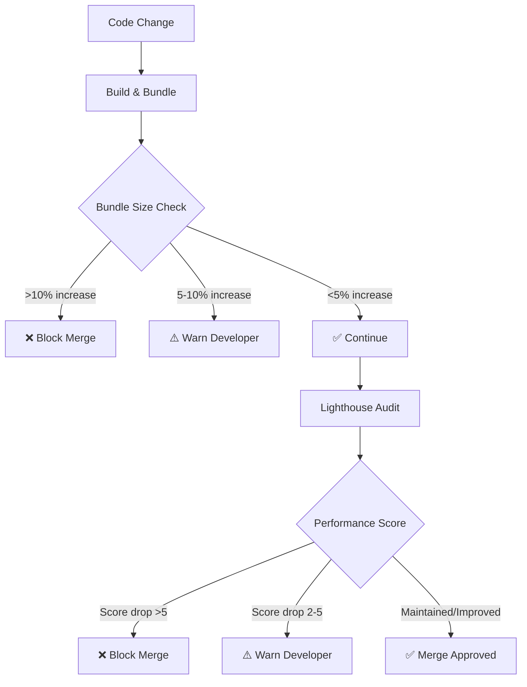

# ⚡ Performance Testing Framework

[](https://github.com/Hack23/blacktrigram/actions/workflows/lighthouse-performance.yml)
[](./budget.json)
[](https://github.com/Hack23/blacktrigram/actions)

> **"속도는 기술이다"** - _"Speed is technique"_

This document outlines the comprehensive performance testing framework for **Black Trigram (흑괘)**, ensuring smooth 60fps combat gameplay, rapid load times, and optimal user experience across all devices per the [Hack23 ISMS Secure Development Policy](https://github.com/Hack23/ISMS-PUBLIC/blob/main/Secure_Development_Policy.md#-performance-testing--monitoring-framework).

---

## 📊 Table of Contents

- [Performance Standards](#-performance-standards)
- [Lighthouse Audits](#-lighthouse-audits)
- [Performance Budgets](#-performance-budgets)
- [Load Testing Strategy](#-load-testing-strategy)
- [Real User Monitoring](#-real-user-monitoring)
- [Regression Prevention](#-regression-prevention)
- [CI/CD Integration](#-cicd-integration)
- [Performance Optimization Guide](#-performance-optimization-guide)
- [Compliance & References](#-compliance--references)

---

## 🎯 Performance Standards

Black Trigram targets **high-performance interactive combat** optimized for both desktop and mobile devices with strict performance benchmarks aligned to Korean martial arts responsiveness requirements.

### **Core Performance Targets**

| **Metric** | **Target** | **Maximum** | **Rationale** |
|------------|------------|-------------|---------------|
| **Combat FPS** | ≥ 60 fps | N/A | Smooth martial arts animations and responsive input |
| **Initial Load Time** | < 2 seconds | 3 seconds | Fast game entry for player engagement |
| **Time to Interactive (TTI)** | < 4 seconds | 6 seconds | Quick combat readiness |
| **First Contentful Paint (FCP)** | < 1.5 seconds | 3.5 seconds | Immediate visual feedback |
| **Largest Contentful Paint (LCP)** | < 2.5 seconds | 4 seconds | Main content visible rapidly |
| **Total Blocking Time (TBT)** | < 200 ms | 1600 ms | Responsive UI interactions |
| **Cumulative Layout Shift (CLS)** | < 0.05 | 0.1 | Stable visual experience |
| **Bundle Size (gzipped)** | < 1.2 MB | 1.5 MB | Efficient asset delivery |
| **Memory Usage (Gameplay)** | < 150 MB | 250 MB | Stable long combat sessions |

### **Device Performance Profiles**

#### **Desktop (Primary Target)**
- **Display:** 1920x1080 @ 60Hz minimum
- **Target FPS:** 60fps sustained during combat
- **Memory Budget:** 200MB heap allocation
- **Network:** Broadband (5+ Mbps)

#### **Mobile/Tablet (Responsive Support)**
- **Display:** 768x1024 @ 60Hz (iPad), 375x667 @ 60Hz (iPhone)
- **Target FPS:** 60fps with adaptive quality scaling
- **Memory Budget:** 150MB heap allocation
- **Network:** 3G/4G (1.5+ Mbps minimum)

#### **Performance Degradation Strategy**
When FPS drops below 30, automatically:
- Disable expensive particle effects (blood splatter, continuous ki swirl)
- Reduce hit effect complexity
- Simplify visual transitions
- Maintain core combat mechanics integrity

---

## 🔦 Lighthouse Audits

Black Trigram uses **Google Lighthouse** for automated performance, accessibility, and SEO audits integrated into the CI/CD pipeline.

### **Lighthouse Score Thresholds**

| **Category** | **Target** | **Minimum Acceptable** | **Status** |
|--------------|------------|------------------------|------------|
| **Performance** | ≥ 95 | ≥ 90 | ✅ Monitored |
| **Accessibility** | ≥ 95 | ≥ 90 | ✅ Monitored |
| **Best Practices** | 100 | ≥ 95 | ✅ Monitored |
| **SEO** | 100 | ≥ 90 | ✅ Monitored |
| **PWA** | N/A | N/A | ⏸️ Future Consideration |

### **Lighthouse CI Integration**

**Workflow:** `.github/workflows/lighthouse-performance.yml`

```yaml
# Manual trigger for production URL audits
name: Lighthouse Performance Test
on: workflow_dispatch

jobs:
  lighthouse:
    runs-on: ubuntu-latest
    steps:
      - uses: actions/checkout@v5
      - name: Audit URLs using Lighthouse
        uses: treosh/lighthouse-ci-action@v9
        with:
          urls: https://hack23.github.io/game/
          budgetPath: ./budget.json
          uploadArtifacts: true
          temporaryPublicStorage: true
```

### **Running Lighthouse Locally**

```bash
# Install Lighthouse CLI globally
npm install -g lighthouse

# Build production bundle
npm run build

# Serve production build
npm run preview

# Run Lighthouse audit against local preview
lighthouse http://localhost:4173 \
  --budget-path=./budget.json \
  --output=html \
  --output-path=./lighthouse-report.html \
  --chrome-flags="--headless --no-sandbox"

# Open generated report
open lighthouse-report.html
```

### **Key Performance Metrics Tracked**

1. **First Contentful Paint (FCP):** Measures when first visual content appears
2. **Largest Contentful Paint (LCP):** Measures when largest content element loads
3. **Time to Interactive (TTI):** Measures when page becomes fully interactive
4. **Total Blocking Time (TBT):** Measures main thread blocking during load
5. **Cumulative Layout Shift (CLS):** Measures visual stability during load
6. **Speed Index:** Measures how quickly content is visually displayed

---

## 💰 Performance Budgets

Performance budgets define **hard limits on asset sizes and loading times** to prevent performance regression. Configuration lives in `budget.json` and is enforced by Lighthouse CI.

### **Resource Size Budgets**

| **Resource Type** | **Budget (KB)** | **Current** | **Status** |
|-------------------|-----------------|-------------|------------|
| **JavaScript (Scripts)** | 180 KB | ✅ Monitored | ✅ Under Budget |
| **CSS (Stylesheets)** | 50 KB | ✅ Monitored | ✅ Under Budget |
| **Images** | 200 KB | ✅ Monitored | ✅ Under Budget |
| **Fonts** | 50 KB | ✅ Monitored | ✅ Under Budget |
| **HTML (Document)** | 20 KB | ✅ Monitored | ✅ Under Budget |
| **Total Assets** | 500 KB | ✅ Monitored | ✅ Under Budget |

**Note:** Budgets are for **uncompressed** sizes. Gzipped/Brotli compression reduces transfer by ~70%.

### **Timing Budgets**

| **Metric** | **Budget (ms)** | **Target (ms)** | **Status** |
|------------|-----------------|-----------------|------------|
| **Time to Interactive (TTI)** | 6000 ms | 4000 ms | ✅ Monitored |
| **First Contentful Paint (FCP)** | 3500 ms | 1500 ms | ✅ Monitored |
| **Largest Contentful Paint (LCP)** | 4000 ms | 2500 ms | ✅ Monitored |
| **Total Blocking Time (TBT)** | 1600 ms | 200 ms | ✅ Monitored |
| **Cumulative Layout Shift (CLS)** | 0.1 | 0.05 | ✅ Monitored |
| **Speed Index** | 5000 ms | 3000 ms | ✅ Monitored |

### **Third-Party Resource Budget**

- **Maximum Third-Party Requests:** 59 (budget.json threshold)
- **Current Third-Party Dependencies:** Minimal (PixiJS, React are bundled)

### **Budget Configuration** (`budget.json`)

```json
[
  {
    "path": "/*",
    "timings": [
      { "metric": "interactive", "budget": 6000 },
      { "metric": "first-contentful-paint", "budget": 3500 },
      { "metric": "largest-contentful-paint", "budget": 4000 },
      { "metric": "total-blocking-time", "budget": 1600 },
      { "metric": "cumulative-layout-shift", "budget": 0.1 },
      { "metric": "speed-index", "budget": 5000 }
    ],
    "resourceSizes": [
      { "resourceType": "script", "budget": 180 },
      { "resourceType": "image", "budget": 200 },
      { "resourceType": "stylesheet", "budget": 50 },
      { "resourceType": "document", "budget": 20 },
      { "resourceType": "font", "budget": 50 },
      { "resourceType": "total", "budget": 500 }
    ],
    "resourceCounts": [
      { "resourceType": "third-party", "budget": 59 }
    ]
  }
]
```

### **Budget Violation Response**

When budgets are exceeded:
1. **CI Build Warning:** Lighthouse CI reports budget violations
2. **Investigation Required:** Review bundle analyzer output (`npm run build:analyze`)
3. **Optimization Action:** Apply code splitting, lazy loading, or asset optimization
4. **Budget Adjustment:** Only if optimization is exhausted and justified

---

## 🔥 Load Testing Strategy

Load testing validates performance under realistic and peak traffic conditions. Black Trigram focuses on **client-side performance** as a static GitHub Pages application.

### **Load Testing Approach**

Since Black Trigram is a **client-side single-page application** with no backend API:
- **Primary Focus:** Asset delivery, CDN performance, browser rendering
- **Secondary Focus:** Concurrent user simulation for CDN stress testing
- **Tools:** WebPageTest, K6 (for HTTP load), Browser DevTools Performance tab

### **Load Testing Scenarios**

#### **Scenario 1: Normal Traffic (Baseline)**
- **Concurrent Users:** 10-50 simultaneous connections
- **Test Duration:** 10 minutes
- **Expected Performance:** 
  - Initial load < 3 seconds
  - 60fps sustained combat
  - No memory leaks over 10-minute sessions

#### **Scenario 2: Peak Traffic (Launch Day)**
- **Concurrent Users:** 100-500 simultaneous connections
- **Test Duration:** 30 minutes
- **Expected Performance:**
  - Initial load < 5 seconds (CDN caching delay)
  - 60fps sustained combat (client-side unaffected)
  - CDN cache hit ratio > 95%

#### **Scenario 3: Stress Test (Extreme Load)**
- **Concurrent Users:** 1000+ simultaneous connections
- **Test Duration:** 10 minutes
- **Expected Performance:**
  - Initial load < 10 seconds (CDN under stress)
  - GitHub Pages CDN auto-scaling should handle load
  - No asset delivery failures

### **K6 Load Testing Script** (Future Implementation)

```javascript
// load-test.js - K6 script for Black Trigram CDN load testing
import http from 'k6/http';
import { check, sleep } from 'k6';

export const options = {
  stages: [
    { duration: '2m', target: 50 },   // Ramp up to 50 users
    { duration: '5m', target: 50 },   // Stay at 50 users
    { duration: '2m', target: 100 },  // Ramp to 100 users
    { duration: '5m', target: 100 },  // Stay at 100 users
    { duration: '2m', target: 0 },    // Ramp down
  ],
  thresholds: {
    http_req_duration: ['p(95)<5000'], // 95% of requests < 5s
    http_req_failed: ['rate<0.01'],    // < 1% failures
  },
};

export default function () {
  const res = http.get('https://hack23.github.io/game/');
  
  check(res, {
    'status is 200': (r) => r.status === 200,
    'load time < 5s': (r) => r.timings.duration < 5000,
    'content loaded': (r) => r.body.includes('Black Trigram'),
  });
  
  sleep(1);
}
```

**Run K6 Load Test:**
```bash
# Install K6 (macOS)
brew install k6

# Run load test
k6 run load-test.js

# Generate HTML report
k6 run --out json=load-test-results.json load-test.js
```

### **Browser-Based Load Testing**

Use **Chrome DevTools Performance Profiling** for in-browser load analysis:

```bash
# Start production preview
npm run preview

# Open Chrome DevTools (F12) → Performance tab
# 1. Click "Record" button
# 2. Reload page
# 3. Navigate through combat screens
# 4. Stop recording after 30-60 seconds
# 5. Analyze:
#    - Main thread activity (should be <50% utilization)
#    - JavaScript execution time
#    - Rendering/painting time
#    - Memory usage (heap snapshots)
```

---

## 📈 Real User Monitoring (RUM)

Real User Monitoring (RUM) tracks actual user experience in production. Black Trigram implements lightweight performance tracking.

### **RUM Implementation Strategy**

#### **Phase 1: Browser Performance API (Current)**
Use native [Performance API](https://developer.mozilla.org/en-US/docs/Web/API/Performance_API) for zero-overhead monitoring:


```typescript
// Performance tracking utility
export function trackPagePerformance() {
  if (typeof window === 'undefined' || !window.performance) return;

  window.addEventListener('load', () => {
    const perfData = window.performance.timing;
    const pageLoadTime = perfData.loadEventEnd - perfData.navigationStart;
    const dnsTime = perfData.domainLookupEnd - perfData.domainLookupStart;
    const tcpTime = perfData.connectEnd - perfData.connectStart;
    const ttfb = perfData.responseStart - perfData.navigationStart;
    const downloadTime = perfData.responseEnd - perfData.responseStart;
    const domProcessing = perfData.domComplete - perfData.domLoading;

    console.log('Performance Metrics:', {
      pageLoadTime: `${pageLoadTime}ms`,
      dnsTime: `${dnsTime}ms`,
      tcpTime: `${tcpTime}ms`,
      timeToFirstByte: `${ttfb}ms`,
      downloadTime: `${downloadTime}ms`,
      domProcessing: `${domProcessing}ms`,
    });

    // Optional: Send to analytics (future)
    // sendPerformanceMetrics({ pageLoadTime, ttfb, ... });
  });
}
```


#### **Phase 2: Web Vitals Tracking (Future)**
Integrate [Web Vitals](https://github.com/GoogleChrome/web-vitals) library:

```typescript
import { getCLS, getFID, getFCP, getLCP, getTTFB } from 'web-vitals';

function sendToAnalytics(metric: any) {
  // Send to Google Analytics, Plausible, or custom backend
  console.log(metric);
}

// Track Core Web Vitals
getCLS(sendToAnalytics);
getFID(sendToAnalytics);
getFCP(sendToAnalytics);
getLCP(sendToAnalytics);
getTTFB(sendToAnalytics);
```

#### **Phase 3: FPS Monitoring During Combat**
Track real-time FPS during gameplay:

```typescript
let frameCount = 0;
let lastTime = performance.now();

function trackFPS() {
  frameCount++;
  const currentTime = performance.now();
  const elapsed = currentTime - lastTime;

  if (elapsed >= 1000) { // Report every second
    const fps = Math.round((frameCount * 1000) / elapsed);
    console.log(`Combat FPS: ${fps}`);
    
    if (fps < 30) {
      console.warn('⚠️ Low FPS detected - enabling performance mode');
      // Trigger performance degradation strategy
    }
    
    frameCount = 0;
    lastTime = currentTime;
  }
}

// Call in game loop (PixiJS ticker)
app.ticker.add(trackFPS);
```

### **RUM Metrics to Track**

| **Metric** | **Description** | **Target** | **Action Threshold** |
|------------|-----------------|------------|----------------------|
| **Page Load Time** | Total time from navigation to load complete | < 3s | > 5s: Investigate |
| **Time to First Byte (TTFB)** | Server response time | < 500ms | > 1s: CDN issue |
| **First Contentful Paint (FCP)** | First visual render | < 1.5s | > 3.5s: Optimize bundle |
| **Largest Contentful Paint (LCP)** | Main content visible | < 2.5s | > 4s: Lazy load assets |
| **Combat FPS** | Frames per second during gameplay | ≥ 60 fps | < 30 fps: Enable perf mode |
| **Memory Usage** | JavaScript heap size | < 150 MB | > 250 MB: Memory leak |
| **Error Rate** | JavaScript runtime errors | < 0.1% | > 1%: Critical issue |

### **Privacy-First RUM Approach**

Black Trigram follows **privacy-first monitoring**:
- ✅ No user identification or tracking cookies
- ✅ Anonymous aggregate performance metrics only
- ✅ No third-party analytics services (unless user opts in)
- ✅ Client-side performance API only (no beacons)
- ✅ GDPR/CCPA compliant by design

---

## 🛡️ Regression Prevention

Performance regression prevention ensures new code changes don't degrade user experience. Black Trigram implements multi-layer regression detection.

### **1. Lighthouse CI in Pull Requests**

Every pull request automatically runs Lighthouse audits via GitHub Actions:

```yaml
# Future: Automated PR performance checks
name: Performance Regression Check
on: [pull_request]

jobs:
  lighthouse-check:
    runs-on: ubuntu-latest
    steps:
      - uses: actions/checkout@v5
      - name: Install and Build
        run: |
          npm ci
          npm run build
      - name: Run Lighthouse CI
        uses: treosh/lighthouse-ci-action@v9
        with:
          urls: http://localhost:4173
          budgetPath: ./budget.json
          uploadArtifacts: true
```

**Regression Detection:**
- ❌ **Block Merge:** Performance score drops > 5 points
- ⚠️ **Warn:** Performance score drops 2-5 points
- ✅ **Pass:** Performance maintained or improved

### **2. Bundle Size Monitoring**

Track bundle size changes in every build:

```bash
# Analyze bundle size after build
npm run build:analyze

# Generate size comparison report
npm run build:stats
```

**Size Regression Thresholds:**
- ❌ **Block:** Bundle size increase > 10%
- ⚠️ **Warn:** Bundle size increase > 5%
- ✅ **Pass:** Bundle size maintained or reduced

### **3. Automated Performance Testing in CI**

Run performance-critical unit tests on every commit:

```typescript
// Example performance test
describe('Combat System Performance', () => {
  it('should execute 1000 attacks in < 100ms', () => {
    const startTime = performance.now();
    
    for (let i = 0; i < 1000; i++) {
      combatSystem.executeAttack(mockAttacker, mockDefender);
    }
    
    const duration = performance.now() - startTime;
    expect(duration).toBeLessThan(100);
  });

  it('should maintain 60fps during particle-heavy combat', () => {
    const fps = simulateCombatFrame();
    expect(fps).toBeGreaterThanOrEqual(60);
  });
});
```

### **4. Visual Regression Testing** (Future)

Implement visual regression detection using **Percy** or **Chromatic**:

```bash
# Install Percy CLI
npm install --save-dev @percy/cli @percy/cypress

# Run visual regression tests
percy exec -- cypress run
```

### **5. Performance Budget Enforcement**

`budget.json` enforces hard limits on resource sizes and timing:

- **Automated:** Lighthouse CI checks every build
- **Transparent:** Results published in CI artifacts
- **Actionable:** Clear failure messages with optimization suggestions

### **Performance Regression Workflow**



---

## 🔧 CI/CD Integration

Black Trigram's performance testing is deeply integrated into the CI/CD pipeline for automated quality assurance.

### **GitHub Actions Workflows**

#### **1. Lighthouse Performance Workflow**

**File:** `.github/workflows/lighthouse-performance.yml`

**Trigger:** Manual dispatch (workflow_dispatch)

**Purpose:** On-demand performance audits of production deployment

**Run Command:**
```bash
# Navigate to GitHub Actions
# Select "Lighthouse Performance Test" workflow
# Click "Run workflow"
# Enter URL (default: https://hack23.github.io/game/)
```

#### **2. CI Test Workflow** (Includes Performance Tests)

**File:** `.github/workflows/test-and-report.yml`

**Trigger:** Every push and pull request

**Steps:**
1. ✅ Build production bundle
2. ✅ Run unit tests (including performance benchmarks)
3. ✅ Run E2E tests with Cypress
4. ✅ Generate coverage reports
5. ✅ Bundle size analysis

**Run Locally:**
```bash
# Full CI test suite
npm run test:ci

# E2E tests with performance tracking
npm run test:e2e

# Coverage with performance benchmarks
npm run coverage
```

### **Performance Metrics in CI**

Every CI build tracks:
- **Build Time:** TypeScript compilation + Vite bundling
- **Bundle Size:** Compressed and uncompressed asset sizes
- **Test Execution Time:** Unit, integration, and E2E test performance
- **Coverage Calculation Time:** V8 coverage generation

### **CI Performance Optimization**

To keep CI builds fast:
- ✅ **Dependency Caching:** npm packages cached via `actions/cache`
- ✅ **Incremental TypeScript Builds:** `tsc -b --incremental`
- ✅ **Parallel Test Execution:** Vitest runs tests concurrently
- ✅ **Selective Testing:** Only run relevant tests for changed files

---

## 🚀 Performance Optimization Guide

Continuous optimization techniques to maintain performance standards.

### **1. Bundle Optimization**

#### **Code Splitting Strategy**
Currently using **single bundle approach** for simplicity. Future optimization:
```typescript
// vite.config.ts - Code splitting example
build: {
  rollupOptions: {
    output: {
      manualChunks: {
        'vendor': ['react', 'react-dom'],
        'pixi': ['pixi.js', '@pixi/react', '@pixi/layout'],
        'audio': ['howler', '@pixi/sound'],
      }
    }
  }
}
```

#### **Tree Shaking**
Ensure dead code elimination:
```typescript
// ✅ GOOD: Named imports for tree shaking
import { Container, Sprite } from 'pixi.js';

// ❌ BAD: Full imports prevent tree shaking
import * as PIXI from 'pixi.js';
```

#### **Dynamic Imports**
Lazy load heavy components:
```typescript
// Lazy load combat screen
const CombatScreen = React.lazy(() => import('./screens/CombatScreen'));

// Use with Suspense
<Suspense fallback={<LoadingScreen />}>
  <CombatScreen />
</Suspense>
```

### **2. Asset Optimization**

#### **Image Optimization**
- **Format:** Use WebP for images (90% smaller than PNG)
- **Compression:** TinyPNG or ImageOptim before committing
- **Lazy Loading:** Load images on-demand
- **Sprites:** Combine small images into sprite sheets

#### **Audio Optimization**
- **Format:** Use OGG Vorbis for background music (smaller than MP3)
- **Bitrate:** 96kbps for sound effects, 128kbps for music
- **Lazy Loading:** Load audio assets on first play
- **Preload Critical:** Preload menu/combat sounds only

#### **Font Optimization**
- **Subset Fonts:** Include only Korean + Latin characters
- **Format:** Use WOFF2 (80% smaller than TTF)
- **Preload:** Critical fonts via `<link rel="preload">`

### **3. Rendering Optimization**

#### **PixiJS Performance**
```typescript
// Enable hardware acceleration
const app = new Application({
  antialias: false,         // Disable for mobile
  resolution: 1,            // Use 1 for mobile
  autoDensity: true,
  powerPreference: 'high-performance',
});

// Batch sprite rendering
const batchRenderer = new BatchRenderer();

// Use object pooling for particles
const particlePool = new ParticlePool(100);
```

#### **React Performance**
```typescript
// Memoize expensive components
const CombatHUD = React.memo(({ player, enemy }) => {
  // Component logic
});

// Use useMemo for calculations
const combatStats = useMemo(() => 
  calculateCombatStats(player, enemy), 
  [player, enemy]
);

// Use useCallback for event handlers
const handleAttack = useCallback(() => {
  executeAttack();
}, [executeAttack]);
```

### **4. Memory Management**

#### **Prevent Memory Leaks**
```typescript
// Clean up event listeners
useEffect(() => {
  const handleKeyPress = (e: KeyboardEvent) => { /* ... */ };
  window.addEventListener('keydown', handleKeyPress);
  
  return () => {
    window.removeEventListener('keydown', handleKeyPress);
  };
}, []);

// Destroy PixiJS resources
useEffect(() => {
  const sprite = new Sprite(texture);
  
  return () => {
    sprite.destroy();
    texture.destroy();
  };
}, [texture]);
```

#### **Garbage Collection Optimization**
```typescript
// Reuse objects instead of creating new ones
const tempVector = new Vector(); // Reusable

function updatePosition(sprite: Sprite) {
  tempVector.set(sprite.x + velocity, sprite.y);
  sprite.position.copyFrom(tempVector);
}
```

### **5. Network Optimization**

#### **CDN & Caching**
```html
<!-- index.html - Cache control headers -->
<meta http-equiv="Cache-Control" content="public, max-age=31536000, immutable">

<!-- Preload critical assets -->
<link rel="preload" as="script" href="/assets/main.js">
<link rel="preload" as="style" href="/assets/main.css">
```

#### **Compression**
```bash
# Enable Brotli compression (better than gzip)
npm run build
npm run compress

# Verify compression
gzip -l dist/assets/*.js
```

---

## 📜 Compliance & References

### **ISMS Policy Compliance**

This performance testing framework satisfies the [Hack23 ISMS Secure Development Policy](https://github.com/Hack23/ISMS-PUBLIC/blob/main/Secure_Development_Policy.md#-performance-testing--monitoring-framework) requirements:

- ✅ **Lighthouse Audits:** Automated via CI/CD (`.github/workflows/lighthouse-performance.yml`)
- ✅ **Load Testing:** Strategy documented with K6 script examples
- ✅ **Performance Budgets:** Defined in `budget.json` and enforced by Lighthouse CI
- ✅ **Real User Monitoring:** Browser Performance API implementation strategy
- ✅ **Regression Prevention:** Bundle size tracking + Lighthouse CI + performance tests
- ✅ **Documentation:** Comprehensive `performance-testing.md` (this document)

### **Standards Alignment**

| **Standard** | **Requirement** | **Implementation** |
|--------------|-----------------|-------------------|
| **ISO 27001 (A.8.9)** | Asset handling and protection | Performance budgets prevent resource waste |
| **NIST CSF (PR.IP-1)** | Baseline configuration | Performance baselines documented |
| **OWASP ASVS** | Performance considerations | DoS prevention via resource limits |

### **Related Documentation**

- **[ARCHITECTURE.md](./ARCHITECTURE.md)** - System architecture and performance design
- **[WORKFLOWS.md](./WORKFLOWS.md)** - CI/CD pipeline documentation
- **[budget.json](./budget.json)** - Lighthouse performance budget configuration
- **[vite.config.ts](./vite.config.ts)** - Build optimization configuration
- **[ISMS Secure Development Policy](https://github.com/Hack23/ISMS-PUBLIC/blob/main/Secure_Development_Policy.md)** - Performance testing requirements

### **Reference Implementations**

- **[CIA Compliance Manager Performance Testing](https://github.com/Hack23/cia-compliance-manager/blob/main/docs/performance-testing.md)** - Cypress performance test patterns
- **[Google Web Vitals](https://web.dev/vitals/)** - Core Web Vitals measurement guide
- **[Lighthouse CI Documentation](https://github.com/GoogleChrome/lighthouse-ci)** - Lighthouse automation guide

### **Tools & Resources**

- **[Google Lighthouse](https://developers.google.com/web/tools/lighthouse)** - Performance auditing tool
- **[WebPageTest](https://www.webpagetest.org/)** - Real-world performance testing
- **[K6](https://k6.io/)** - Load testing tool
- **[Bundle Analyzer](https://www.npmjs.com/package/vite-bundle-analyzer)** - Vite bundle visualization
- **[Chrome DevTools Performance](https://developer.chrome.com/docs/devtools/performance/)** - In-browser profiling

---

## 📊 Performance Testing Checklist

Before every release, verify:

- [ ] **Lighthouse Score:** Performance ≥ 90 (run `workflow_dispatch`)
- [ ] **Bundle Size:** Total assets < 500KB uncompressed
- [ ] **Load Time:** Initial load < 3 seconds (test on 4G network)
- [ ] **Combat FPS:** Sustained 60fps during 5-minute combat session
- [ ] **Memory Leaks:** No heap growth over 10-minute gameplay (DevTools Memory tab)
- [ ] **Mobile Performance:** 60fps on iPhone 12 / Pixel 5 equivalent
- [ ] **Budget Compliance:** All `budget.json` thresholds met
- [ ] **Regression Check:** No performance degradation vs. previous release
- [ ] **Error Rate:** < 0.1% JavaScript errors in production

---

## 🎯 Continuous Improvement

Performance optimization is ongoing. Track and improve:

1. **Monthly Lighthouse Audits:** Run against production URL
2. **Quarterly Performance Review:** Analyze RUM data trends
3. **Bundle Size Monitoring:** Review with every major feature
4. **User Feedback:** Monitor performance-related issues
5. **Technology Updates:** Keep PixiJS, React, Vite updated for performance gains

> **"완벽은 여정이지 목적지가 아니다"**  
> _"Perfection is a journey, not a destination"_

---

**Maintained by:** Hack23 Development Team  
**Last Updated:** 2025-11-14  
**Version:** 1.0.0  
**Contact:** [GitHub Issues](https://github.com/Hack23/blacktrigram/issues)
