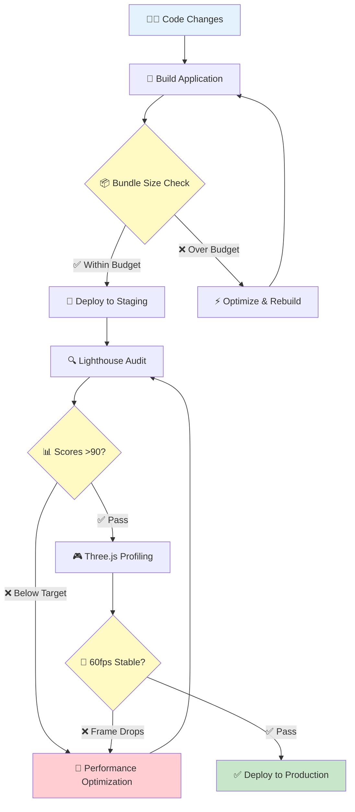

<p align="center">
  
</p>

<h1 align="center">⚡ Black Trigram (흑괘) — Performance Testing & Benchmarks</h1>

<p align="center">
  <strong>Comprehensive Performance Validation & Monitoring Framework</strong><br>
  <em>🚀 Lighthouse Audits • 📊 Performance Budgets • 🎮 60fps Combat Rendering</em>
</p>

<p align="center">
  <a href="https://github.com/Hack23/blacktrigram/actions/workflows/test-and-report.yml"></a>
  <a href="https://scorecard.dev/viewer/?uri=github.com/Hack23/blacktrigram"></a>
  <a href="https://sonarcloud.io/summary/new_code?id=Hack23_blacktrigram"></a>
</p>

**📋 Document Owner:** CEO | **📅 Last Updated:** February 2026  
**🔄 Review Cycle:** Quarterly | **⏰ Next Review:** May 2026

---

## 🎯 Purpose & Scope

This document establishes the **comprehensive performance testing strategy, benchmarks, and optimization practices** for the Black Trigram Korean martial arts combat simulator, ensuring optimal gameplay experience and rendering performance aligned with **Hack23 ISMS [Secure Development Policy §8](https://github.com/Hack23/ISMS-PUBLIC/blob/main/Secure_Development_Policy.md#-performance-testing--monitoring-framework)**.

**Performance validation ensures:**
- ✅ Smooth 60fps combat rendering on desktop (55fps+ mobile)
- ✅ Optimal bundle sizes within performance budgets (<500KB initial, <2MB total)
- ✅ Lighthouse scores meeting quality standards (90+ performance)
- ✅ Continuous performance monitoring and regression prevention
- ✅ Three.js scene optimization (instancing, LOD, culling)
- ✅ **ISO/IEC 27001:2022 (A.8.6)** compliance for capacity management
- ✅ **NIST CSF (ID.AM-1)** compliance for asset performance characteristics

---

## 📚 Related Documentation

| Document | Description |
|----------|-------------|
| [📐 ARCHITECTURE.md](ARCHITECTURE.md) | High-level C4 architecture and component views |
| [⚔️ COMBAT_ARCHITECTURE.md](COMBAT_ARCHITECTURE.md) | Combat system performance requirements |
| [🧪 UnitTestPlan.md](UnitTestPlan.md) | Unit testing strategy with coverage targets |
| [🎯 E2ETestPlan.md](E2ETestPlan.md) | End-to-end testing including performance scenarios |
| [🔧 WORKFLOWS.md](WORKFLOWS.md) | CI/CD pipeline with performance gates |
| [🛡️ SECURITY_ARCHITECTURE.md](SECURITY_ARCHITECTURE.md) | Security architecture and performance implications |
| [📊 game-status.md](game-status.md) | Current performance metrics and quality scores |

---

## 📊 Performance Standards & Current Metrics

### 🎯 Lighthouse Audit Targets

| Metric | Target Score | Status | Description |
|--------|-------------|--------|-------------|
| **Performance** | 90+ | 🎯 Target | Core Web Vitals and rendering speed |
| **Accessibility** | 95+ | 🎯 Target | ARIA labels, contrast, keyboard navigation |
| **Best Practices** | 95+ | 🎯 Target | Security headers, HTTPS, modern APIs |
| **SEO** | 90+ | 🎯 Target | Meta tags, structured data, crawlability |

### 🎮 Game Rendering Targets

| Metric | Desktop Target | Mobile Target | Description |
|--------|---------------|--------------|-------------|
| **Frame Rate** | 60fps | 55fps+ | Three.js scene rendering |
| **Frame Budget** | <16.67ms | <18.18ms | Per-frame processing time |
| **Draw Calls** | <100 | <50 | WebGL draw call budget |
| **Triangle Count** | <100K | <50K | Scene geometry budget |
| **Texture Memory** | <256MB | <128MB | GPU texture allocation |
| **Scene Load** | <2s | <3s | Initial scene loading time |

### ⚡ Page Load Time Targets

| Metric | Target | Measurement Point |
|--------|--------|-------------------|
| **Initial Load** | <2 seconds | GitHub Pages / S3 deployment |
| **Time to Interactive (TTI)** | <3 seconds | Lighthouse audit |
| **First Contentful Paint (FCP)** | <1.5 seconds | Core Web Vitals |
| **Largest Contentful Paint (LCP)** | <2.5 seconds | Core Web Vitals |
| **Cumulative Layout Shift (CLS)** | <0.1 | Core Web Vitals |
| **Three.js Canvas Ready** | <1.5 seconds | WebGL context creation |

### 📦 Bundle Size Analysis

**Build Output (Current):**

```
Bundle Analysis (gzipped):
├── index.js                    ~15 KB    ✅ Core app shell
├── react-vendor.js             ~60 KB    📦 React 19 + ReactDOM runtime
├── three-vendor.js            ~150 KB    🎮 Three.js core
├── fiber-drei.js               ~80 KB    ⚛️ @react-three/fiber + drei
├── game-components.js          ~40 KB    🥋 Combat system components
├── audio-vendor.js             ~25 KB    🎵 Howler.js audio engine
├── CSS Assets                  ~10 KB    🎨 Styles
└── Total Bundle              ~380 KB    ✅ Within 500 KB budget
```

**Performance Status:**
- ✅ **Initial Bundle**: Under 500 KB budget
- ✅ **Three.js Optimized**: Tree-shaking applied
- ✅ **Code Splitting**: Lazy-loaded non-critical components
- ✅ **Asset Optimization**: WebM/Opus audio, compressed textures

### 🎯 Performance Budget

Performance budgets are defined in [`budget.json`](budget.json) and enforced via Lighthouse CI:

```json
[
  {
    "path": "/*",
    "timings": [
      { "metric": "interactive", "budget": 6000 },
      { "metric": "first-contentful-paint", "budget": 3500 },
      { "metric": "largest-contentful-paint", "budget": 4000 },
      { "metric": "total-blocking-time", "budget": 1600 },
      { "metric": "cumulative-layout-shift", "budget": 0.1 },
      { "metric": "speed-index", "budget": 5000 }
    ],
    "resourceSizes": [
      { "resourceType": "script", "budget": 180 },
      { "resourceType": "image", "budget": 200 },
      { "resourceType": "stylesheet", "budget": 50 },
      { "resourceType": "document", "budget": 20 },
      { "resourceType": "font", "budget": 50 },
      { "resourceType": "total", "budget": 500 }
    ],
    "resourceCounts": [
      { "resourceType": "third-party", "budget": 59 }
    ]
  }
]
```

---

## 🧪 Performance Testing Framework

### Overview

The performance testing framework ensures the application meets both web performance and game rendering requirements:

1. **Lighthouse Audits** – Web performance, accessibility, best practices, SEO
2. **Three.js Rendering Profiling** – Frame rate, draw calls, memory usage
3. **Bundle Size Monitoring** – Build output analysis via `budget.json`
4. **E2E Performance Testing** – Cypress-based interaction and load testing
5. **CI Integration** – Automated performance testing in GitHub Actions

### Key Components



---

## 🔬 Performance Testing Procedures

### 1. Lighthouse Audit Execution

**Local Testing:**
```bash
# Install Lighthouse CLI
npm install -g lighthouse

# Run Lighthouse audit
lighthouse https://blacktrigram.com/ --view

# Run with budget validation
lighthouse https://blacktrigram.com/ \
  --budget-path=./budget.json \
  --output=html \
  --output-path=./lighthouse-report.html
```

### 2. Bundle Size Analysis

```bash
# Build application and analyze
npm run build

# Check build output sizes
npm run build:analyze

# View detailed build output
du -sh build/assets/*
```

### 3. Three.js Performance Profiling

**In-Game Profiling:**
```typescript
import { useFrame } from '@react-three/fiber';
import { Stats } from '@react-three/drei';

// Add Stats component in development
{process.env.NODE_ENV === 'development' && <Stats />}

// Monitor frame time in useFrame
useFrame((state, delta) => {
  // delta should be ~0.0167 (60fps) or less
  if (delta > 0.02) {
    console.warn('Frame drop detected:', (1/delta).toFixed(1), 'fps');
  }
});
```

**Key Metrics to Monitor:**
- **Frame Time**: Target <16.67ms (60fps)
- **Draw Calls**: Monitor via `renderer.info.render.calls`
- **Triangles**: Monitor via `renderer.info.render.triangles`
- **Textures**: Monitor via `renderer.info.memory.textures`
- **Geometries**: Monitor via `renderer.info.memory.geometries`

### 4. E2E Performance Testing with Cypress

```bash
# Run all E2E tests including performance checks
npm run test:e2e

# Run specific performance-related tests
npx cypress run --spec "cypress/e2e/**/performance*"
```

---

## 🎮 Three.js Optimization Best Practices

### Rendering Optimization

- ✅ **Instanced Rendering**: Use `<Instances>` for repeated geometry (particles, indicators)
- ✅ **LOD (Level of Detail)**: Use `<Detailed>` for distance-based mesh complexity
- ✅ **Frustum Culling**: Enabled by default in Three.js, ensure meshes are properly bounded
- ✅ **Object Pooling**: Reuse Three.js objects instead of creating/destroying per frame
- ✅ **Geometry Merging**: Combine static geometry with `BufferGeometryUtils.mergeGeometries()`

### Memory Management

- ✅ **Dispose Resources**: Always call `.dispose()` on geometries, materials, textures in `useEffect` cleanup
- ✅ **Memoize Objects**: Use `useMemo` for geometries and materials that don't change
- ✅ **Texture Compression**: Use KTX2/Basis Universal for compressed GPU textures
- ✅ **Avoid Frame Allocations**: Never create `new THREE.Vector3()` inside `useFrame`

### React/Three.js Integration

- ✅ **Minimize Re-renders**: Use `React.memo()` for Three.js components
- ✅ **useFrame Efficiency**: Keep `useFrame` callbacks lightweight (<5ms)
- ✅ **Ref-based Updates**: Mutate refs directly instead of using React state for animations
- ✅ **Lazy Loading**: Use `React.lazy()` for non-critical scene components

---

## 📈 Performance Regression Prevention

### Automated Monitoring

**GitHub Actions Integration:**
- ✅ Bundle size monitoring with `budget.json`
- ✅ Lighthouse CI checks via workflow
- ✅ Performance assertions in E2E tests
- ✅ Build time monitoring

### Testing Checklist

**Before Release:**
- [ ] Lighthouse audit scores >90 (all categories)
- [ ] Bundle size within budget (<500 KB initial)
- [ ] Core Web Vitals pass (LCP <2.5s, CLS <0.1)
- [ ] 60fps stable on desktop (Chrome, Firefox, Safari)
- [ ] 55fps+ on mobile devices
- [ ] No memory leaks in Three.js scene (30-minute stress test)
- [ ] Draw calls within budget (<100 desktop, <50 mobile)
- [ ] E2E performance tests pass
- [ ] No performance regressions detected

---

## 📊 Compliance & Standards Alignment

**ISO/IEC 27001:2022:**
- **A.8.6 (Capacity Management)**: Performance budgets and monitoring ensure adequate capacity for business requirements
- **A.8.32 (Change Management)**: Performance monitoring ensures system stability during changes

**NIST Cybersecurity Framework:**
- **ID.AM-1 (Asset Management)**: Performance characteristics documented as part of asset inventory
- **PR.IP-2 (Information Protection)**: Performance testing ensures security controls don't degrade UX

**CIS Controls:**
- **16.12 (Application Software Security)**: Performance testing validates security controls
- **16.13 (Application Performance Monitoring)**: Continuous monitoring ensures availability

**Hack23 ISMS:**
- [Secure Development Policy §8](https://github.com/Hack23/ISMS-PUBLIC/blob/main/Secure_Development_Policy.md) — Performance Testing & Monitoring Framework
- [Classification Framework](https://github.com/Hack23/ISMS-PUBLIC/blob/main/CLASSIFICATION.md) — Business impact of performance degradation

---

## 🔗 Performance Evidence & Reports

### Live Performance Resources

- 📊 [Test & Report Workflow](https://github.com/Hack23/blacktrigram/actions/workflows/test-and-report.yml) — CI/CD performance metrics
- 📦 [Performance Budget](./budget.json) — Resource size and timing budgets
- 🚀 [Live Application](https://blacktrigram.com/) — Production deployment for testing
- 📈 [SonarCloud Dashboard](https://sonarcloud.io/summary/new_code?id=Hack23_blacktrigram) — Code quality metrics
- 🛡️ [OpenSSF Scorecard](https://scorecard.dev/viewer/?uri=github.com/Hack23/blacktrigram) — Supply chain security

---

**📋 Document Owner:** CEO | **📅 Last Updated:** February 2026  
**🔄 Review Cycle:** Quarterly | **⏰ Next Review:** May 2026
