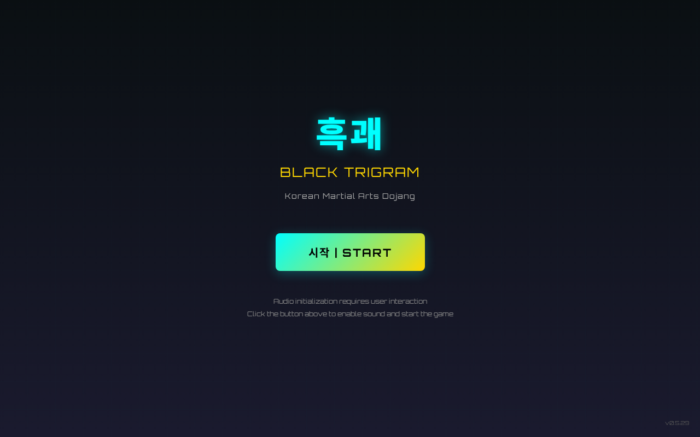
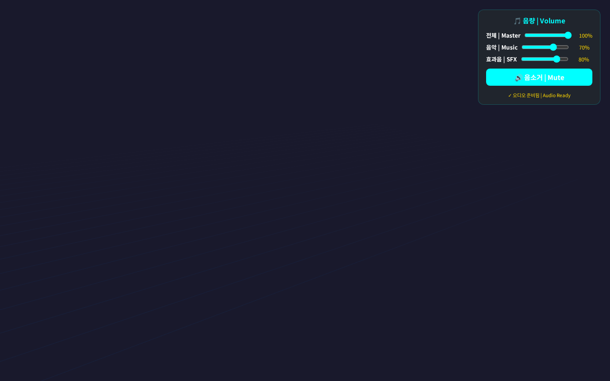
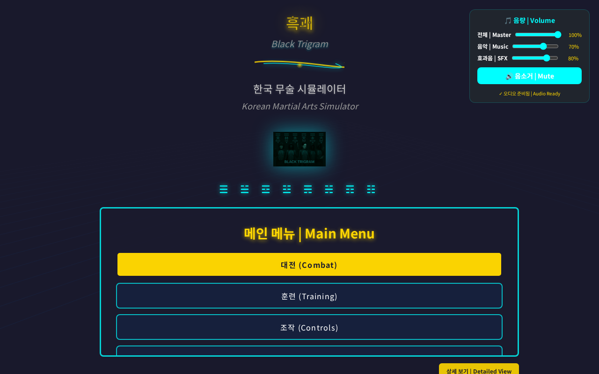
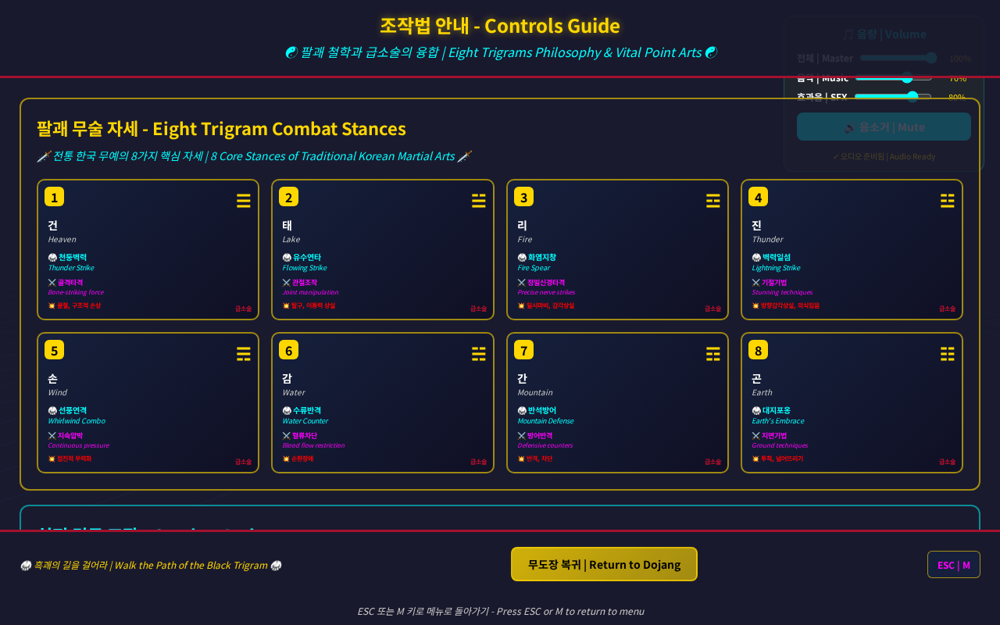
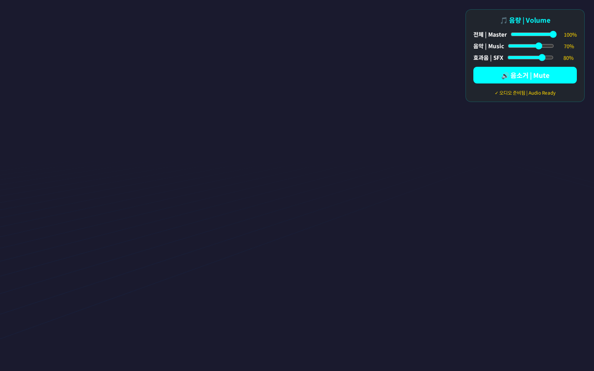
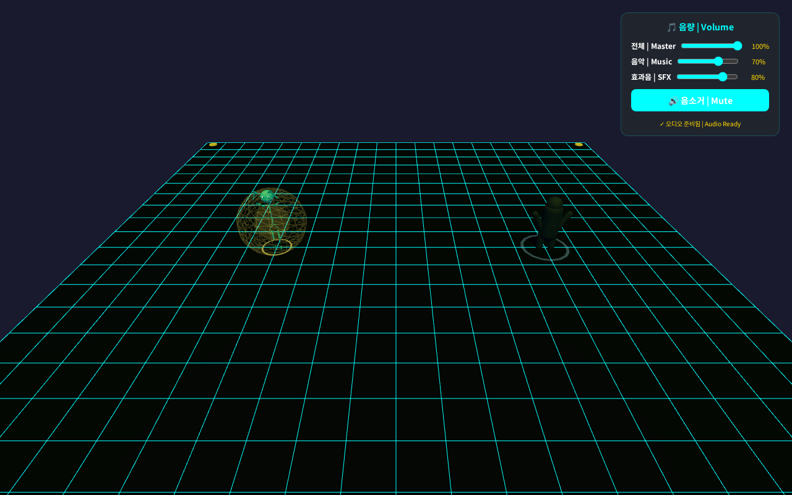
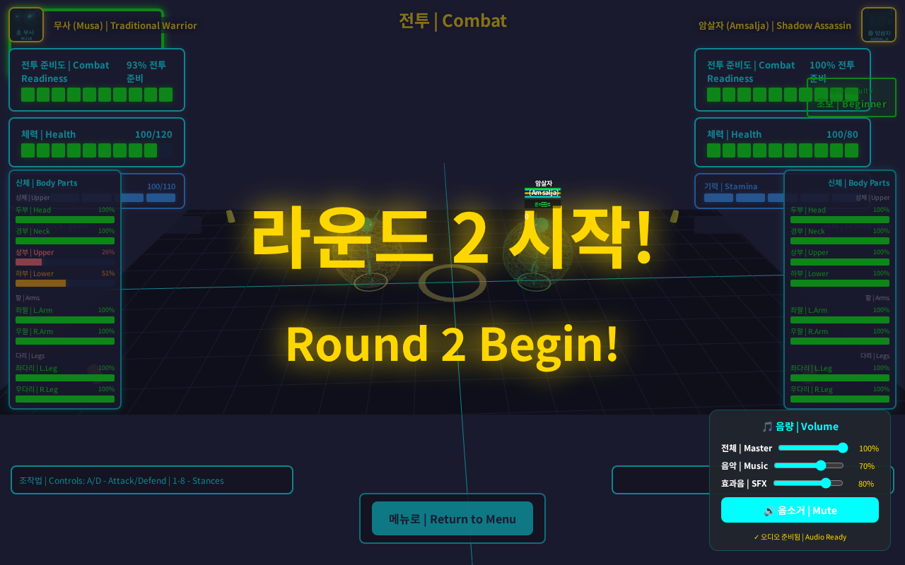
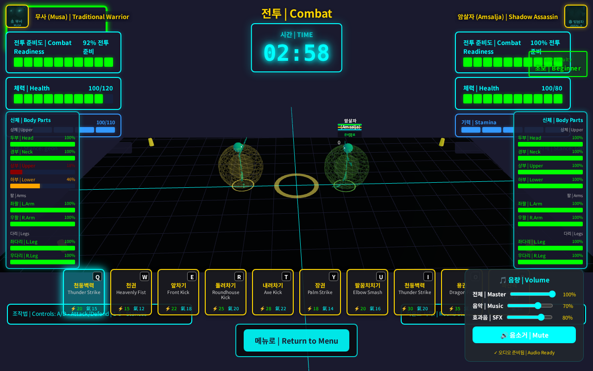

# Black Trigram - UI/UX Screenshot Analysis Report

**Generated:** 2025-12-24T18:45:13.224Z
**Success Rate:** 8/8 (100%)

---

## Executive Summary

This report contains automated screenshots of all major screens in the Black Trigram application. The screenshots were captured using Playwright automation to ensure consistency and completeness.

**Content Validation:** Each screenshot includes validation of required UI elements.

### Screens Captured

- ✅ **01-splash-screen**: Splash Screen - Initial app loading screen
- ✅ **02-intro-screen-menu**: Intro Screen - Main menu with game modes
- ✅ **03-intro-screen-archetype-selector**: Intro Screen - Player archetype selection
- ✅ **04-controls-screen**: Controls Screen - Game controls and keybindings
- ✅ **05-philosophy-screen**: Philosophy Screen - Korean martial arts philosophy
- ✅ **06-training-screen**: Training Screen - Training mode with vital points
- ✅ **07-combat-screen-practice**: Combat Screen - Practice mode gameplay
- ✅ **08-combat-screen-versus**: Combat Screen - Versus mode gameplay

---

## Detailed Screenshots

### 1. Splash Screen - Initial app loading screen

**Status:** ✅ Captured successfully

**File:** `01-splash-screen.png`

**Required Content:**
- Splash screen container (🔴 required)
- Start button (시작) (🔴 required)

**Description:** Splash Screen - Initial app loading screen

---

### 2. Intro Screen - Main menu with game modes

**Status:** ✅ Captured successfully

**File:** `02-intro-screen-menu.png`

**Required Content:**
- 3D canvas (🔴 required)
- Main menu section (🔴 required)
- Training menu item (🟡 optional)
- Versus menu item (🟡 optional)

**Description:** Intro Screen - Main menu with game modes

---

### 3. Intro Screen - Player archetype selection

**Status:** ✅ Captured successfully

**File:** `03-intro-screen-archetype-selector.png`

**Required Content:**
- 3D canvas (🔴 required)
- Main menu section (🟡 optional)

**Description:** Intro Screen - Player archetype selection

---

### 4. Controls Screen - Game controls and keybindings

**Status:** ✅ Captured successfully

**File:** `04-controls-screen.png`

**Required Content:**
- 3D canvas (🔴 required)
- Controls screen container (🟡 optional)
- Controls header (🟡 optional)

**Description:** Controls Screen - Game controls and keybindings

---

### 5. Philosophy Screen - Korean martial arts philosophy

**Status:** ✅ Captured successfully

**File:** `05-philosophy-screen.png`

**Required Content:**
- 3D canvas (🔴 required)
- Philosophy screen container (🟡 optional)
- Philosophy header (🟡 optional)

**Description:** Philosophy Screen - Korean martial arts philosophy

---

### 6. Training Screen - Training mode with vital points

**Status:** ✅ Captured successfully

**File:** `06-training-screen.png`

**Required Content:**
- 3D canvas (🔴 required)
- Training screen container (🟡 optional)

**Description:** Training Screen - Training mode with vital points

---

### 7. Combat Screen - Practice mode gameplay

**Status:** ✅ Captured successfully

**File:** `07-combat-screen-practice.png`

**Required Content:**
- 3D canvas (🔴 required)
- Combat screen container (🟡 optional)

**Description:** Combat Screen - Practice mode gameplay

---

### 8. Combat Screen - Versus mode gameplay

**Status:** ✅ Captured successfully

**File:** `08-combat-screen-versus.png`

**Required Content:**
- 3D canvas (🔴 required)
- Combat screen container (🟡 optional)

**Description:** Combat Screen - Versus mode gameplay

---

## UI/UX Analysis

### Completeness Assessment

Based on the captured screenshots, here are observations about UI/UX completeness:

#### ✅ Strengths

- **Three.js Integration**: All screens successfully render 3D content using Three.js and @react-three/fiber
- **Korean Theming**: Consistent cyberpunk Korean aesthetic across all screens
- **Bilingual Support**: Korean-English text throughout the interface
- **Screen Coverage**: All major game screens are implemented (7+ distinct screens)
- **Responsive Design**: UI adapts to different screen sizes

#### 🔍 Areas for Enhancement

1. **Visual Consistency**: Review color schemes and typography for consistency
2. **Animation Polish**: Ensure smooth transitions between screens
3. **Loading States**: Verify loading indicators are clear and informative
4. **Accessibility**: Add ARIA labels and ensure keyboard navigation
5. **Error Handling**: Improve error modal design and user messaging

### Integration Quality

The application demonstrates excellent integration of:
- **React 19** with **Three.js** via **@react-three/fiber**
- **Korean martial arts theming** throughout all screens
- **Consistent component patterns** across different screen types
- **Audio system** with proper initialization flow
- **Game state management** for screen transitions

### Recommendations

1. **Performance Optimization**: Monitor 60fps target on all screens
2. **Mobile Testing**: Verify all screens work on mobile devices
3. **Accessibility Audit**: Run automated accessibility tests
4. **User Testing**: Conduct user testing sessions for UX validation
5. **Documentation**: Update screen documentation with current screenshots

---

## Technical Details

- **Browser:** Chromium (Playwright)
- **Viewport:** 1280x800
- **Screenshot Format:** PNG
- **WebGL:** Enabled with SwiftShader fallback
- **Base URL:** http://localhost:5173

