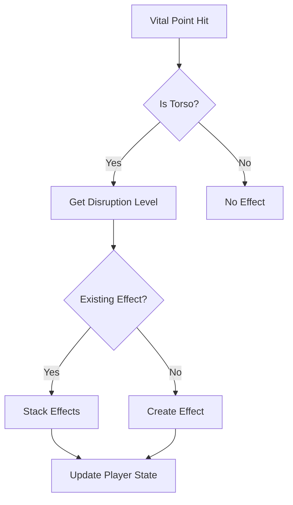
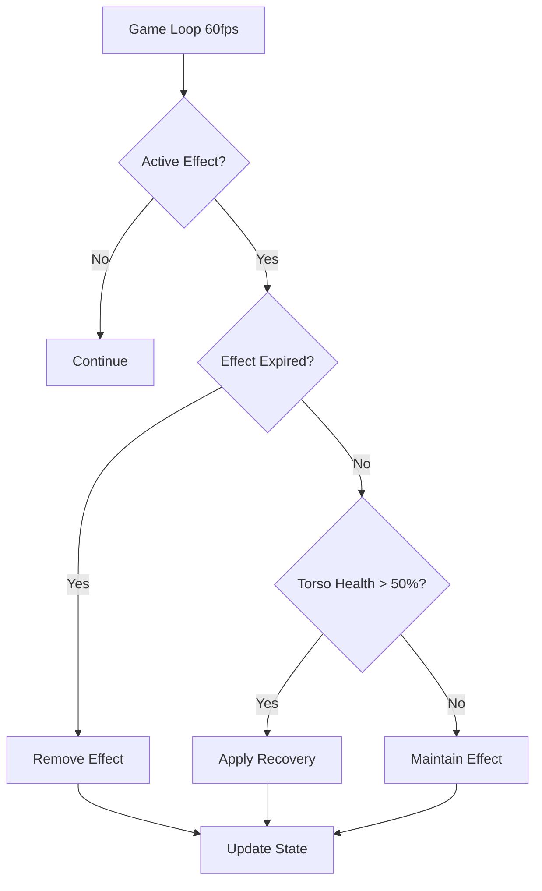

# Breathing Disruption System (호흡곤란 시스템)

**Status**: ✅ Core Implementation Complete | 📋 Visual Feedback Pending

Realistic respiratory targeting system for Korean martial arts combat, implementing authentic torso strike effects with stamina regeneration penalties.

## 🎯 Overview

The Breathing Disruption System adds tactical depth to combat by modeling realistic breathing difficulty from torso strikes. Based on traditional Korean martial arts (태권도, 합기도, 택견) knowledge of vital point targeting (급소학), the system creates authentic combat trauma where damaged fighters must manage their breathing and stamina carefully.

### Core Principles

- **Torso Targeting Rewards**: Rewarding precision torso strikes over simple head/limb attacks
- **Stamina Management**: Creating tactical gameplay around breathing recovery
- **Cumulative Trauma**: Multiple torso hits stack duration and severity
- **Recovery Mechanics**: Fighters with healthy torsos (>50%) recover faster
- **Korean Authenticity**: Based on traditional Korean martial arts vital point knowledge

## 🚀 Quick Start

```typescript
import {
  BreathingDisruptionSystem,
  BreathingDisruptionLevel,
  applyBreathingDisruptionFromVitalPoint,
  updateBreathingDisruption,
} from "@/systems/breathing";

// When vital point is struck
let player = applyBreathingDisruptionFromVitalPoint(
  player,
  solarPlexusVitalPoint,
  damage,
  timestamp
);

// In game loop (60fps)
player = updateBreathingDisruption(player, deltaTime, timestamp);

// Calculate modified stamina regen
const baseRegen = 10;
const actualRegen = BreathingDisruptionSystem.calculateStaminaRegen(
  player,
  baseRegen
);
// With Gasping effect: actualRegen = 5 (50% of base)
```

## 📊 Disruption Levels

### Winded (바람맞음)
- **Stamina Regen Penalty**: 25% (0.75x multiplier)
- **Duration**: 5 seconds
- **Caused By**: Moderate torso strikes (10-19 damage)
- **Korean**: 중간 강도의 몸통 타격

### Gasping (헐떡임)
- **Stamina Regen Penalty**: 50% (0.50x multiplier)
- **Duration**: 10 seconds
- **Caused By**: Heavy torso strikes (20+ damage) or rib vital points
- **Korean**: 강한 몸통 타격

### Severely Winded (심각한 호흡곤란)
- **Stamina Regen Penalty**: 75% (0.25x multiplier)
- **Duration**: 15 seconds
- **Caused By**: Solar plexus (명치) or diaphragm (횡격막) vital strikes
- **Korean**: 명치 급소 타격

## 🎯 Torso Vital Points

Nine torso vital points cause breathing disruption:

| Vital Point | Korean | Level | Penalty | Duration |
|-------------|--------|-------|---------|----------|
| **Solar Plexus** | 명치 (Myeongchi) | Severely Winded | 75% | 15s |
| **Diaphragm** | 횡격막 (Hoenggyeongmak) | Severely Winded | 75% | 15s |
| **Floating Ribs** | 늑골 (Neukgol) | Gasping | 50% | 10s |
| **Left Rib** | 좌측 늑골 | Gasping | 50% | 10s |
| **Right Rib** | 우측 늑골 | Gasping | 50% | 10s |
| **Abdomen** | 복부 (Bokbu) | Winded | 25% | 5s |
| **Liver** | 간 (Gan) | Winded | 25% | 5s |
| **Left Kidney** | 좌측 신장 | Winded | 25% | 5s |
| **Right Kidney** | 우측 신장 | Winded | 25% | 5s |

## 🔧 API Reference

### Core System

#### `BreathingDisruptionSystem`

Static methods for managing breathing disruption:

```typescript
// Create effect at specific severity
const effect = BreathingDisruptionSystem.createEffect(
  BreathingDisruptionLevel.GASPING,
  "Rib Strike",
  Date.now()
);

// Calculate level from damage
const level = BreathingDisruptionSystem.calculateLevelFromDamage(
  25,        // damage
  false      // isSolarPlexus
);

// Stack multiple effects
const stacked = BreathingDisruptionSystem.stackEffect(
  existingEffect,
  newLevel,
  "Second Strike",
  timestamp
);

// Get active effect
const active = BreathingDisruptionSystem.getActiveEffect(player);

// Calculate modified stamina regen
const regen = BreathingDisruptionSystem.calculateStaminaRegen(
  player,
  10  // baseRegenRate
);

// Check recovery eligibility
const canRecover = BreathingDisruptionSystem.canRecover(player);

// Apply gradual recovery
const recovered = BreathingDisruptionSystem.applyGradualRecovery(
  effect,
  deltaTime,
  timestamp
);

// Get current level
const level = BreathingDisruptionSystem.getCurrentLevel(player);

// Check if active
const isActive = BreathingDisruptionSystem.isActive(player);
```

### Integration Functions

#### `applyBreathingDisruptionFromVitalPoint()`

Apply breathing disruption when a vital point is struck:

```typescript
const updatedPlayer = applyBreathingDisruptionFromVitalPoint(
  player,
  vitalPoint,
  damage,
  timestamp
);
```

**Parameters**:
- `player: PlayerState` - Current player state
- `vitalPoint: VitalPoint` - Vital point that was struck
- `damage: number` - Base damage dealt
- `timestamp: number` - Current game time (milliseconds)

**Returns**: `PlayerState` with breathing disruption effect applied

#### `applyBreathingDisruptionFromTorsoDamage()`

Apply breathing disruption from general torso damage:

```typescript
const updatedPlayer = applyBreathingDisruptionFromTorsoDamage(
  player,
  damage,
  isSolarPlexusArea,
  timestamp
);
```

**Parameters**:
- `player: PlayerState` - Current player state
- `damage: number` - Torso damage amount
- `isSolarPlexusArea: boolean` - Whether strike was near solar plexus
- `timestamp: number` - Current game time

**Returns**: `PlayerState` with breathing disruption applied

#### `updateBreathingDisruption()`

Update breathing disruption effects each frame:

```typescript
// Call in game loop at 60fps
const updatedPlayer = updateBreathingDisruption(
  player,
  deltaTime,  // 16.67ms for 60fps
  timestamp
);
```

**Features**:
- Removes expired effects
- Applies gradual recovery when torso health > 50%
- Maintains effect state for ongoing disruption

#### `upgradeLegacyBreathlessness()`

Convert legacy breathlessness effects to new system:

```typescript
const upgraded = upgradeLegacyBreathlessness(player, timestamp);
```

Automatically upgrades old-style breathlessness status effects to use the new breathing disruption system with proper stamina regen penalties.

## 🔄 Integration with Combat System

### Vital Point Strike Flow



### Frame Update Flow



## 📈 Performance

### Benchmarks

All operations are 60fps compatible (target: <1ms per frame):

| Operation | Average Time | Peak Time |
|-----------|--------------|-----------|
| Effect Creation | <0.5ms | <1ms |
| Stamina Calculation | <0.05ms | <0.1ms |
| Frame Update | <0.08ms | <0.2ms |
| Effect Stacking | <0.6ms | <1.2ms |

### Memory Usage

- **Effect Size**: ~400 bytes per BreathingDisruptionEffect
- **Typical Active Effects**: 0-2 per player (800 bytes max)
- **Total Overhead**: <1KB per player

## 🧪 Testing

### Test Coverage

```
Statement Coverage: 98.21%
Branch Coverage: 84.84%
Function Coverage: 100%
Total Tests: 56 (all passing)
```

### Test Categories

- **Effect Creation** (5 tests): Verify all disruption levels
- **Damage Calculation** (4 tests): Severity from damage amounts
- **Effect Stacking** (3 tests): Cumulative effects
- **Player State** (5 tests): Integration with PlayerState
- **Stamina Regen** (4 tests): Penalty calculations
- **Recovery** (4 tests): Gradual recovery mechanics
- **Edge Cases** (6 tests): Zero damage, negative values, etc.
- **Performance** (2 tests): 60fps benchmarks
- **Integration** (21 tests): Vital point system integration
- **Korean Authenticity** (2 tests): Terminology validation

### Running Tests

```bash
# Run all breathing system tests
npm test -- src/systems/breathing

# Run with coverage
npm test -- --coverage src/systems/breathing

# Run specific test file
npm test -- src/systems/breathing/BreathingDisruptionSystem.test.ts
```

## 🌟 Korean Martial Arts Context

### Traditional Knowledge (급소학)

The breathing disruption system is based on authentic Korean martial arts vital point knowledge:

**명치 (Myeongchi) - Solar Plexus**
- Traditional Target: 신경총 (Singyeongjong - Nerve Plexus)
- Effect: Instant breath disruption, severe pain
- Martial Arts: 태권도 (Taekwondo), 합기도 (Hapkido)

**늑골 (Neukgol) - Ribs**
- Traditional Target: Floating ribs, intercostal nerves
- Effect: Breathing difficulty, cumulative damage
- Martial Arts: 택견 (Taekyon), 합기도 (Hapkido)

**횡격막 (Hoenggyeongmak) - Diaphragm**
- Traditional Target: Respiratory muscle control
- Effect: Severe breathing disruption
- Martial Arts: 합기도 (Hapkido), Traditional Korean martial arts

### Combat Philosophy (무술 철학)

**정격자 (Jeonggyeokja) - Precision Striker**
> "Every strike targets anatomical vulnerabilities"

Breathing disruption embodies the precision striker philosophy by rewarding accurate torso targeting over random attacks.

**급소격 (Geupsogyeok) - Vital Point Strike**
> "Authentic pressure point combat"

The system models realistic vital point effects from traditional Korean martial arts knowledge.

## 📋 TODO: Visual & Audio Feedback

### Planned Visual Feedback
- [ ] HUD breathing difficulty indicator (lungs icon 🫁)
- [ ] Color-coded severity (green → yellow → red)
- [ ] Gasping animation state
- [ ] Bent-over posture for severe disruption
- [ ] Breathing recovery visual feedback

### Planned Audio Feedback
- [ ] Heavy breathing sounds (Winded)
- [ ] Gasping audio (Gasping)
- [ ] Wheezing sounds (Severely Winded)
- [ ] Breathing normalization audio (Recovery)
- [ ] Korean voice callouts (호흡곤란!)

### Integration Requirements
- [ ] Wire to PlayerEffectManager for automatic frame updates
- [ ] Connect to DamageCalculator for automatic application
- [ ] Add to CombatHUD display
- [ ] Create animation state transitions

## 🤝 Contributing

When extending the breathing disruption system:

1. **Maintain Korean Authenticity**: Use proper Korean terminology and romanization
2. **Preserve Performance**: Keep calculations <1ms for 60fps compatibility
3. **Add Tests**: Maintain >90% test coverage
4. **Document Thoroughly**: Include JSDoc with Korean-English descriptions
5. **Follow Patterns**: Use existing effect stacking and recovery patterns

## 📚 Related Systems

- **Vital Point System** (`src/systems/vitalpoint`): Anatomical targeting
- **Status Effect System** (`src/systems/types.ts`): Base effect framework
- **Player State** (`src/systems/player.ts`): Combat state management
- **Body Part Health** (`src/systems/bodypart`): Torso health tracking
- **Stamina System**: Regeneration and energy management

## 📖 References

- **Korean Martial Arts**: 태권도 (Taekwondo), 합기도 (Hapkido), 택견 (Taekyon)
- **Vital Point Knowledge**: 급소학 (Geupso-hak)
- **Traditional Medicine**: 경혈 (Gyeonghyeol - Acupuncture points)
- **Game Design**: COMBAT_ARCHITECTURE.md, game-design.md

---

**흑괘의 길을 걸어라** - _Walk the Path of the Black Trigram_

**Version**: 1.0.0 (Core Implementation)  
**Status**: ✅ Production Ready | 📋 Visual Feedback Pending  
**Last Updated**: 2024-12-25
